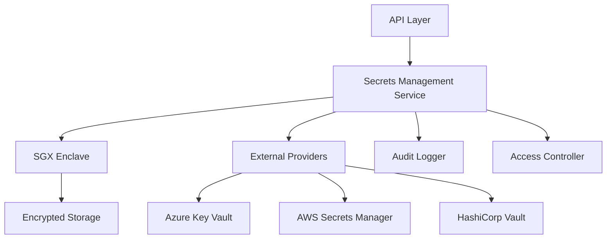

# Secrets Management

The Neo Service Layer includes a comprehensive secrets management system that provides secure storage, retrieval, and management of sensitive data within a trusted execution environment (TEE). This system supports both local encrypted storage and integration with external secret providers.

## Overview

The secrets management system is designed with the following key principles:

- **Security First**: All secrets are encrypted and stored within the SGX enclave
- **Zero Trust**: No plaintext secrets are ever stored outside the TEE
- **Audit Trail**: All secret access is logged and tracked
- **External Integration**: Seamless sync with cloud secret providers
- **Version Control**: Support for secret versioning and rotation
- **Access Control**: Role-based access control and IP restrictions

## Architecture



## Security Improvements (Latest)

### 🔒 Critical Security Fixes Applied

The following critical security vulnerabilities have been addressed:

1. **Hardcoded Encryption Keys Removed**
   - Replaced zero/hardcoded keys with proper key derivation
   - Implemented PBKDF2 with 600,000 iterations (OWASP 2023 recommendation)
   - Added HKDF-based key derivation for SGX storage

2. **JWT Secret Management Enhanced**
   - Removed hardcoded JWT secrets from configuration files
   - Added environment variable validation with minimum length requirements
   - Implemented forbidden key detection to prevent use of example keys

3. **Certificate Validation Improved**
   - Replaced hardcoded certificate thumbprints with proper Intel certificate validation
   - Added support for multiple trusted Intel SGX root certificates
   - Implemented certificate extension validation for Intel-specific OIDs

### 🛡️ Environment Variable Security

**Required Environment Variables:**
```bash
# JWT Authentication (minimum 32 characters)
JWT_SECRET_KEY="your-secure-jwt-key-minimum-32-characters"

# TEE/Enclave Operations (minimum 32 characters)  
ENCLAVE_MASTER_KEY="your-secure-enclave-master-key"

# Optional: SGX Sealed Storage (production environments)
SGX_SEALED_STORAGE_KEY="base64-encoded-sealed-key"
```

**Key Generation Examples:**
```bash
# Generate secure JWT key
openssl rand -base64 32

# Generate secure enclave master key
openssl rand -base64 64

# Generate secure password with special characters
openssl rand -base64 48 | tr -d "=+/" | cut -c1-32
```

## Features

### Core Functionality

1. **Secure Storage**: AES-256-GCM encryption within SGX enclave
2. **Secret Versioning**: Multiple versions with rollback capability
3. **Expiration Management**: Automatic cleanup of expired secrets
4. **Backup & Restore**: Encrypted backup with key derivation
5. **Metadata Management**: Rich metadata with tags and descriptions

### External Provider Integration

- **Azure Key Vault**: Native integration with Azure AD authentication
- **AWS Secrets Manager**: IAM-based authentication and cross-region support
- **HashiCorp Vault**: Enterprise secret management integration
- **Google Secret Manager**: GCP-native secret storage
- **Kubernetes Secrets**: Direct K8s secret synchronization

### Access Control

- **Role-Based Access**: Read/Write/Delete permissions per role
- **Service Restrictions**: Limit access to specific services
- **IP Whitelisting**: Network-based access control
- **Audit Logging**: Comprehensive access logging

## Quick Start

### 1. Basic Setup

```csharp
// Configure services
services.AddSecretsManagement(options =>
{
    options.EnableAzureKeyVault = true;
    options.EnableAwsSecretsManager = true;
    options.MaxSecretCount = 10000;
    options.EnableAuditLogging = true;
});

// Add external providers
services.AddAzureKeyVault("https://my-keyvault.vault.azure.net/");
services.AddAwsSecretsManager("us-west-2");
```

### 2. Store a Secret

```csharp
var secretsService = serviceProvider.GetRequiredService<ISecretsManagementService>();

var secureValue = new SecureString();
foreach (char c in "my-secret-value")
{
    secureValue.AppendChar(c);
}
secureValue.MakeReadOnly();

var metadata = await secretsService.StoreSecretAsync(
    secretId: "database-connection",
    name: "Database Connection String",
    value: secureValue,
    options: new StoreSecretOptions
    {
        Description = "Production database connection",
        ContentType = SecretContentType.ConnectionString,
        ExpiresAt = DateTime.UtcNow.AddDays(365),
        Tags = new Dictionary<string, string>
        {
            ["environment"] = "production",
            ["type"] = "database"
        }
    });
```

### 3. Retrieve a Secret

```csharp
var secret = await secretsService.GetSecretAsync("database-connection");
if (secret != null)
{
    // Use the secure value
    var connectionString = SecureStringToString(secret.Value);
    // ... use connection string ...
}
```

### 4. List Secrets

```csharp
var secrets = await secretsService.ListSecretsAsync(new GetSecretsOptions
{
    Tags = new Dictionary<string, string> { ["environment"] = "production" },
    IncludeExpired = false,
    Limit = 100
});
```

## API Reference

### REST API Endpoints

#### Store Secret
```http
POST /api/v1/secrets
Content-Type: application/json

{
  "secretId": "api-key-service-x",
  "name": "Service X API Key",
  "value": "sk-1234567890abcdef",
  "description": "API key for external service",
  "contentType": "ApiKey",
  "tags": {
    "service": "external-api",
    "environment": "production"
  }
}
```

#### Get Secret
```http
GET /api/v1/secrets/api-key-service-x?version=2
```

#### List Secrets
```http
GET /api/v1/secrets?tags=environment=production,type=api-key&limit=50
```

#### Rotate Secret
```http
POST /api/v1/secrets/api-key-service-x/rotate
Content-Type: application/json

{
  "newValue": "sk-newkey1234567890",
  "disableOldVersion": true
}
```

#### External Provider Sync
```http
POST /api/v1/secrets/external-providers/sync
Content-Type: application/json

{
  "providerType": "AzureKeyVault",
  "direction": "Pull",
  "secretIds": ["api-key-service-x", "database-connection"]
}
```

### C# API

#### ISecretsManagementService Interface

```csharp
public interface ISecretsManagementService
{
    Task<SecretMetadata> StoreSecretAsync(string secretId, string name, SecureString value, StoreSecretOptions? options = null, BlockchainType blockchainType = BlockchainType.NeoN3, CancellationToken cancellationToken = default);
    
    Task<Secret?> GetSecretAsync(string secretId, int? version = null, BlockchainType blockchainType = BlockchainType.NeoN3, CancellationToken cancellationToken = default);
    
    Task<SecretMetadata?> GetSecretMetadataAsync(string secretId, int? version = null, BlockchainType blockchainType = BlockchainType.NeoN3, CancellationToken cancellationToken = default);
    
    Task<IEnumerable<SecretMetadata>> ListSecretsAsync(GetSecretsOptions? options = null, BlockchainType blockchainType = BlockchainType.NeoN3, CancellationToken cancellationToken = default);
    
    Task<SecretMetadata> UpdateSecretAsync(string secretId, SecureString value, string? description = null, BlockchainType blockchainType = BlockchainType.NeoN3, CancellationToken cancellationToken = default);
    
    Task<bool> DeleteSecretAsync(string secretId, BlockchainType blockchainType = BlockchainType.NeoN3, CancellationToken cancellationToken = default);
    
    Task<SecretMetadata> RotateSecretAsync(string secretId, SecureString newValue, bool disableOldVersion = true, BlockchainType blockchainType = BlockchainType.NeoN3, CancellationToken cancellationToken = default);
}
```

## Configuration

### Environment Variables

```bash
# SGX Configuration
SGX_MODE=HW  # or SIM for simulation
ENCLAVE_SECURE_STORAGE_PATH=/secure/storage

# Azure Key Vault
AZURE_KEY_VAULT_URL=https://my-vault.vault.azure.net/
AZURE_TENANT_ID=your-tenant-id
AZURE_CLIENT_ID=your-client-id
AZURE_CLIENT_SECRET=your-client-secret

# AWS Secrets Manager
AWS_REGION=us-west-2
AWS_ACCESS_KEY_ID=your-access-key
AWS_SECRET_ACCESS_KEY=your-secret-key

# Service Configuration
SECRETS_MAX_COUNT=10000
SECRETS_DEFAULT_EXPIRATION_DAYS=365
SECRETS_ENABLE_AUDIT_LOGGING=true
```

### appsettings.json

```json
{
  "SecretsManagement": {
    "MaxSecretCount": 10000,
    "DefaultExpirationDays": 365,
    "EnableAuditLogging": true,
    "EnableAutomaticRotation": false,
    "AutoRotationIntervalDays": 90,
    "EnableBackup": true,
    "BackupIntervalHours": 24,
    "ExternalProviders": {
      "AzureKeyVault": {
        "Enabled": true,
        "KeyVaultUrl": "https://my-vault.vault.azure.net/"
      },
      "AwsSecretsManager": {
        "Enabled": true,
        "Region": "us-west-2"
      }
    }
  }
}
```

## Security Considerations

### Encryption

- **At Rest**: AES-256-GCM with SGX-generated keys
- **In Transit**: TLS 1.3 for all external communications
- **In Memory**: SecureString for temporary values
- **Key Derivation**: HKDF-SHA256 for key derivation

### Access Control

```csharp
var accessControl = new SecretAccessControl
{
    ReadRoles = new List<string> { "SecretReader", "Admin" },
    WriteRoles = new List<string> { "SecretWriter", "Admin" },
    DeleteRoles = new List<string> { "Admin" },
    AllowedServices = new List<string> { "api-service", "worker-service" },
    AllowedIpRanges = new List<string> { "10.0.0.0/8", "192.168.1.0/24" },
    RequireAuditLogging = true
};
```

### Best Practices

1. **Principle of Least Privilege**: Grant minimal required permissions
2. **Regular Rotation**: Implement automatic secret rotation
3. **Audit Monitoring**: Monitor all secret access patterns
4. **Backup Strategy**: Regular encrypted backups with separate keys
5. **Network Security**: Use VPNs and private networks when possible

## Backup and Recovery

### Backup Process

```csharp
// Export secrets to encrypted backup
var backupKey = GenerateBackupKey();
var backupData = await secretsManager.ExportSecretsAsync(
    secretIds: null, // all secrets
    encryptionKey: backupKey);

// Store backup securely
await StoreBackupSecurely(backupData, backupKey);
```

### Recovery Process

```csharp
// Restore from encrypted backup
var backupData = await LoadBackupSecurely();
var backupKey = GetBackupKey();

var importedCount = await secretsManager.ImportSecretsAsync(
    backupData: backupData,
    decryptionKey: backupKey,
    overwriteExisting: false);
```

## Monitoring and Alerts

### Key Metrics

- Secret access frequency and patterns
- Failed authentication attempts
- Secret expiration warnings
- External provider sync status
- Enclave health and performance

### Prometheus Metrics

```
# HELP secrets_total Total number of secrets stored
# TYPE secrets_total gauge
secrets_total{blockchain_type="NeoN3"} 1500

# HELP secret_access_total Total number of secret access requests
# TYPE secret_access_total counter
secret_access_total{operation="get",blockchain_type="NeoN3"} 15000

# HELP secret_rotation_total Total number of secret rotations
# TYPE secret_rotation_total counter
secret_rotation_total{blockchain_type="NeoN3"} 250
```

## Troubleshooting

### Common Issues

1. **Enclave Initialization Failed**
   - Check SGX drivers and AESM service
   - Verify hardware support or use simulation mode

2. **External Provider Connection Failed**
   - Verify credentials and network connectivity
   - Check provider-specific configuration

3. **Permission Denied**
   - Verify role assignments and access control
   - Check IP whitelist configuration

4. **Secret Not Found**
   - Verify secret ID and version
   - Check expiration status

### Debug Mode

```bash
# Enable debug logging
export ASPNETCORE_ENVIRONMENT=Development
export Logging__LogLevel__NeoServiceLayer.Services.SecretsManagement=Debug
```

## Performance Considerations

### Optimization Tips

1. **Caching**: Metadata is cached in memory for performance
2. **Batch Operations**: Use bulk operations when possible
3. **Connection Pooling**: External providers use connection pooling
4. **Async Operations**: All operations are asynchronous

### Scale Limits

- **Maximum Secrets**: 10,000 (configurable)
- **Secret Size**: 64KB per secret value
- **Concurrent Operations**: 100 per second
- **External Sync**: 50 secrets per batch

## Migration Guide

### From Other Secret Managers

```csharp
// Example: Migrate from Azure Key Vault
var azureSecrets = await azureKeyVaultClient.GetSecretsAsync();

foreach (var azureSecret in azureSecrets)
{
    var secureValue = StringToSecureString(azureSecret.Value);
    
    await secretsService.StoreSecretAsync(
        secretId: azureSecret.Name,
        name: azureSecret.Name,
        value: secureValue,
        options: new StoreSecretOptions
        {
            Description = $"Migrated from Azure Key Vault",
            Tags = azureSecret.Tags
        });
}
```

## Contributing

To extend the secrets management system:

1. **New Providers**: Implement `IExternalSecretProvider`
2. **Custom Storage**: Extend the enclave storage layer
3. **Authentication**: Add new authentication mechanisms
4. **Monitoring**: Add custom metrics and alerts

## License

The secrets management system is part of the Neo Service Layer and follows the same licensing terms.