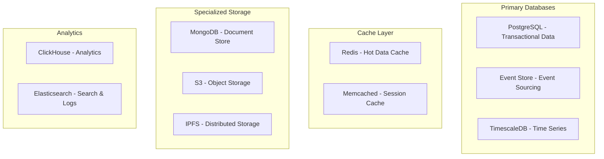

# Neo Service Layer - Database Design Specification

## 1. Database Architecture Overview

### 1.1 Multi-Database Strategy



### 1.2 Data Distribution Strategy

| Data Type | Primary Store | Cache | Backup | Retention |
|-----------|--------------|-------|---------|-----------|
| User Data | PostgreSQL | Redis | S3 | Indefinite |
| Transactions | PostgreSQL | Redis | S3 | 7 years |
| Events | Event Store | - | S3 | 5 years |
| Time Series | TimescaleDB | Redis | S3 | 2 years |
| Documents | MongoDB | Redis | S3 | As needed |
| Logs | Elasticsearch | - | S3 | 90 days |
| Analytics | ClickHouse | - | S3 | 1 year |

## 2. PostgreSQL Schema Design

### 2.1 Core Schema

```sql
-- Enable required extensions
CREATE EXTENSION IF NOT EXISTS "uuid-ossp";
CREATE EXTENSION IF NOT EXISTS "pgcrypto";
CREATE EXTENSION IF NOT EXISTS "pg_trgm";
CREATE EXTENSION IF NOT EXISTS "btree_gist";

-- Create schemas
CREATE SCHEMA IF NOT EXISTS core;
CREATE SCHEMA IF NOT EXISTS auth;
CREATE SCHEMA IF NOT EXISTS blockchain;
CREATE SCHEMA IF NOT EXISTS enclave;
CREATE SCHEMA IF NOT EXISTS audit;

-- Core domain tables
CREATE TABLE core.services (
    id UUID PRIMARY KEY DEFAULT uuid_generate_v4(),
    name VARCHAR(255) NOT NULL UNIQUE,
    description TEXT,
    version VARCHAR(50) NOT NULL,
    status VARCHAR(50) NOT NULL DEFAULT 'inactive',
    configuration JSONB NOT NULL DEFAULT '{}',
    metadata JSONB NOT NULL DEFAULT '{}',
    created_at TIMESTAMPTZ NOT NULL DEFAULT CURRENT_TIMESTAMP,
    updated_at TIMESTAMPTZ NOT NULL DEFAULT CURRENT_TIMESTAMP,
    CONSTRAINT services_status_check CHECK (
        status IN ('active', 'inactive', 'degraded', 'maintenance')
    )
);

CREATE TABLE core.tenants (
    id UUID PRIMARY KEY DEFAULT uuid_generate_v4(),
    name VARCHAR(255) NOT NULL,
    identifier VARCHAR(100) NOT NULL UNIQUE,
    subscription_tier VARCHAR(50) NOT NULL DEFAULT 'free',
    settings JSONB NOT NULL DEFAULT '{}',
    limits JSONB NOT NULL DEFAULT '{}',
    created_at TIMESTAMPTZ NOT NULL DEFAULT CURRENT_TIMESTAMP,
    updated_at TIMESTAMPTZ NOT NULL DEFAULT CURRENT_TIMESTAMP,
    deleted_at TIMESTAMPTZ,
    CONSTRAINT tenants_tier_check CHECK (
        subscription_tier IN ('free', 'basic', 'pro', 'enterprise')
    )
);

-- Add row-level security
ALTER TABLE core.tenants ENABLE ROW LEVEL SECURITY;

CREATE POLICY tenant_isolation ON core.tenants
    USING (id = current_setting('app.current_tenant')::uuid);
```

### 2.2 Authentication Schema

```sql
CREATE TABLE auth.users (
    id UUID PRIMARY KEY DEFAULT uuid_generate_v4(),
    tenant_id UUID NOT NULL REFERENCES core.tenants(id),
    email VARCHAR(255) NOT NULL,
    username VARCHAR(100) NOT NULL,
    password_hash VARCHAR(255) NOT NULL,
    mfa_secret VARCHAR(255),
    mfa_enabled BOOLEAN NOT NULL DEFAULT FALSE,
    email_verified BOOLEAN NOT NULL DEFAULT FALSE,
    status VARCHAR(50) NOT NULL DEFAULT 'active',
    last_login_at TIMESTAMPTZ,
    failed_login_attempts INT NOT NULL DEFAULT 0,
    locked_until TIMESTAMPTZ,
    created_at TIMESTAMPTZ NOT NULL DEFAULT CURRENT_TIMESTAMP,
    updated_at TIMESTAMPTZ NOT NULL DEFAULT CURRENT_TIMESTAMP,
    deleted_at TIMESTAMPTZ,
    CONSTRAINT users_email_unique UNIQUE (tenant_id, email),
    CONSTRAINT users_username_unique UNIQUE (tenant_id, username),
    CONSTRAINT users_status_check CHECK (
        status IN ('active', 'inactive', 'locked', 'suspended')
    )
);

CREATE TABLE auth.sessions (
    id UUID PRIMARY KEY DEFAULT uuid_generate_v4(),
    user_id UUID NOT NULL REFERENCES auth.users(id) ON DELETE CASCADE,
    token_hash VARCHAR(255) NOT NULL UNIQUE,
    refresh_token_hash VARCHAR(255) UNIQUE,
    ip_address INET NOT NULL,
    user_agent TEXT,
    expires_at TIMESTAMPTZ NOT NULL,
    revoked_at TIMESTAMPTZ,
    created_at TIMESTAMPTZ NOT NULL DEFAULT CURRENT_TIMESTAMP
);

CREATE TABLE auth.permissions (
    id UUID PRIMARY KEY DEFAULT uuid_generate_v4(),
    name VARCHAR(100) NOT NULL UNIQUE,
    resource VARCHAR(100) NOT NULL,
    action VARCHAR(50) NOT NULL,
    description TEXT,
    created_at TIMESTAMPTZ NOT NULL DEFAULT CURRENT_TIMESTAMP,
    CONSTRAINT permissions_unique UNIQUE (resource, action)
);

CREATE TABLE auth.roles (
    id UUID PRIMARY KEY DEFAULT uuid_generate_v4(),
    tenant_id UUID NOT NULL REFERENCES core.tenants(id),
    name VARCHAR(100) NOT NULL,
    description TEXT,
    is_system BOOLEAN NOT NULL DEFAULT FALSE,
    created_at TIMESTAMPTZ NOT NULL DEFAULT CURRENT_TIMESTAMP,
    updated_at TIMESTAMPTZ NOT NULL DEFAULT CURRENT_TIMESTAMP,
    CONSTRAINT roles_name_unique UNIQUE (tenant_id, name)
);

-- Many-to-many relationships
CREATE TABLE auth.role_permissions (
    role_id UUID NOT NULL REFERENCES auth.roles(id) ON DELETE CASCADE,
    permission_id UUID NOT NULL REFERENCES auth.permissions(id) ON DELETE CASCADE,
    PRIMARY KEY (role_id, permission_id)
);

CREATE TABLE auth.user_roles (
    user_id UUID NOT NULL REFERENCES auth.users(id) ON DELETE CASCADE,
    role_id UUID NOT NULL REFERENCES auth.roles(id) ON DELETE CASCADE,
    granted_at TIMESTAMPTZ NOT NULL DEFAULT CURRENT_TIMESTAMP,
    granted_by UUID REFERENCES auth.users(id),
    expires_at TIMESTAMPTZ,
    PRIMARY KEY (user_id, role_id)
);

-- Indexes for performance
CREATE INDEX idx_users_email ON auth.users(email) WHERE deleted_at IS NULL;
CREATE INDEX idx_users_tenant ON auth.users(tenant_id) WHERE deleted_at IS NULL;
CREATE INDEX idx_sessions_user ON auth.sessions(user_id);
CREATE INDEX idx_sessions_expires ON auth.sessions(expires_at) WHERE revoked_at IS NULL;
CREATE INDEX idx_user_roles_user ON auth.user_roles(user_id);
CREATE INDEX idx_role_permissions_role ON auth.role_permissions(role_id);
```

### 2.3 Blockchain Schema

```sql
CREATE TABLE blockchain.networks (
    id UUID PRIMARY KEY DEFAULT uuid_generate_v4(),
    name VARCHAR(100) NOT NULL UNIQUE,
    chain_id BIGINT NOT NULL UNIQUE,
    network_type VARCHAR(50) NOT NULL,
    rpc_endpoint VARCHAR(500) NOT NULL,
    ws_endpoint VARCHAR(500),
    explorer_url VARCHAR(500),
    is_testnet BOOLEAN NOT NULL DEFAULT FALSE,
    is_active BOOLEAN NOT NULL DEFAULT TRUE,
    created_at TIMESTAMPTZ NOT NULL DEFAULT CURRENT_TIMESTAMP
);

CREATE TABLE blockchain.wallets (
    id UUID PRIMARY KEY DEFAULT uuid_generate_v4(),
    user_id UUID NOT NULL REFERENCES auth.users(id),
    network_id UUID NOT NULL REFERENCES blockchain.networks(id),
    address VARCHAR(255) NOT NULL,
    public_key VARCHAR(500),
    encrypted_private_key TEXT, -- Encrypted in enclave
    wallet_type VARCHAR(50) NOT NULL,
    is_hardware BOOLEAN NOT NULL DEFAULT FALSE,
    created_at TIMESTAMPTZ NOT NULL DEFAULT CURRENT_TIMESTAMP,
    CONSTRAINT wallets_address_unique UNIQUE (network_id, address)
);

CREATE TABLE blockchain.transactions (
    id UUID PRIMARY KEY DEFAULT uuid_generate_v4(),
    network_id UUID NOT NULL REFERENCES blockchain.networks(id),
    transaction_hash VARCHAR(255) NOT NULL,
    from_address VARCHAR(255) NOT NULL,
    to_address VARCHAR(255),
    value NUMERIC(78, 0) NOT NULL DEFAULT 0,
    gas_price NUMERIC(78, 0),
    gas_limit BIGINT,
    gas_used BIGINT,
    nonce BIGINT,
    input_data TEXT,
    status VARCHAR(50) NOT NULL DEFAULT 'pending',
    block_number BIGINT,
    block_timestamp TIMESTAMPTZ,
    confirmation_count INT DEFAULT 0,
    created_at TIMESTAMPTZ NOT NULL DEFAULT CURRENT_TIMESTAMP,
    updated_at TIMESTAMPTZ NOT NULL DEFAULT CURRENT_TIMESTAMP,
    CONSTRAINT transactions_hash_unique UNIQUE (network_id, transaction_hash),
    CONSTRAINT transactions_status_check CHECK (
        status IN ('pending', 'confirmed', 'failed', 'dropped')
    )
);

CREATE TABLE blockchain.smart_contracts (
    id UUID PRIMARY KEY DEFAULT uuid_generate_v4(),
    network_id UUID NOT NULL REFERENCES blockchain.networks(id),
    address VARCHAR(255) NOT NULL,
    name VARCHAR(255),
    symbol VARCHAR(50),
    contract_type VARCHAR(50) NOT NULL,
    abi JSONB NOT NULL,
    bytecode TEXT,
    source_code TEXT,
    compiler_version VARCHAR(50),
    optimization_enabled BOOLEAN,
    verified BOOLEAN NOT NULL DEFAULT FALSE,
    deployed_by VARCHAR(255),
    deployed_at TIMESTAMPTZ,
    created_at TIMESTAMPTZ NOT NULL DEFAULT CURRENT_TIMESTAMP,
    CONSTRAINT contracts_address_unique UNIQUE (network_id, address)
);

-- Indexes for blockchain queries
CREATE INDEX idx_transactions_from ON blockchain.transactions(from_address);
CREATE INDEX idx_transactions_to ON blockchain.transactions(to_address);
CREATE INDEX idx_transactions_block ON blockchain.transactions(block_number DESC);
CREATE INDEX idx_transactions_status ON blockchain.transactions(status) 
    WHERE status = 'pending';
CREATE INDEX idx_wallets_user ON blockchain.wallets(user_id);
```

### 2.4 Enclave Schema

```sql
CREATE TABLE enclave.attestations (
    id UUID PRIMARY KEY DEFAULT uuid_generate_v4(),
    enclave_id VARCHAR(255) NOT NULL,
    mr_enclave VARCHAR(64) NOT NULL,
    mr_signer VARCHAR(64) NOT NULL,
    isv_prod_id INT NOT NULL,
    isv_svn INT NOT NULL,
    report_data VARCHAR(128),
    quote BYTEA NOT NULL,
    attestation_type VARCHAR(50) NOT NULL,
    status VARCHAR(50) NOT NULL,
    verified_at TIMESTAMPTZ,
    expires_at TIMESTAMPTZ NOT NULL,
    created_at TIMESTAMPTZ NOT NULL DEFAULT CURRENT_TIMESTAMP,
    CONSTRAINT attestations_type_check CHECK (
        attestation_type IN ('EPID', 'DCAP', 'ECDSA')
    )
);

CREATE TABLE enclave.sealed_data (
    id UUID PRIMARY KEY DEFAULT uuid_generate_v4(),
    owner_id UUID NOT NULL REFERENCES auth.users(id),
    enclave_id VARCHAR(255) NOT NULL,
    data_key VARCHAR(255) NOT NULL UNIQUE,
    sealed_blob BYTEA NOT NULL,
    mac VARCHAR(64) NOT NULL,
    policy VARCHAR(50) NOT NULL,
    version INT NOT NULL DEFAULT 1,
    created_at TIMESTAMPTZ NOT NULL DEFAULT CURRENT_TIMESTAMP,
    updated_at TIMESTAMPTZ NOT NULL DEFAULT CURRENT_TIMESTAMP,
    CONSTRAINT sealed_data_policy_check CHECK (
        policy IN ('MRENCLAVE', 'MRSIGNER', 'USER_DEFINED')
    )
);

CREATE TABLE enclave.computations (
    id UUID PRIMARY KEY DEFAULT uuid_generate_v4(),
    user_id UUID NOT NULL REFERENCES auth.users(id),
    enclave_id VARCHAR(255) NOT NULL,
    operation_type VARCHAR(100) NOT NULL,
    input_hash VARCHAR(64) NOT NULL,
    output_hash VARCHAR(64),
    status VARCHAR(50) NOT NULL DEFAULT 'pending',
    started_at TIMESTAMPTZ,
    completed_at TIMESTAMPTZ,
    error_message TEXT,
    gas_used BIGINT,
    created_at TIMESTAMPTZ NOT NULL DEFAULT CURRENT_TIMESTAMP,
    CONSTRAINT computations_status_check CHECK (
        status IN ('pending', 'running', 'completed', 'failed', 'cancelled')
    )
);
```

## 3. Event Store Design

### 3.1 Event Sourcing Schema

```sql
-- Event store database
CREATE DATABASE event_store;

\c event_store;

CREATE TABLE events (
    event_id UUID PRIMARY KEY DEFAULT uuid_generate_v4(),
    aggregate_id UUID NOT NULL,
    aggregate_type VARCHAR(255) NOT NULL,
    event_type VARCHAR(255) NOT NULL,
    event_version INT NOT NULL,
    event_data JSONB NOT NULL,
    metadata JSONB NOT NULL DEFAULT '{}',
    user_id UUID,
    correlation_id UUID,
    causation_id UUID,
    created_at TIMESTAMPTZ NOT NULL DEFAULT CURRENT_TIMESTAMP,
    CONSTRAINT events_unique UNIQUE (aggregate_id, event_version)
);

CREATE TABLE snapshots (
    snapshot_id UUID PRIMARY KEY DEFAULT uuid_generate_v4(),
    aggregate_id UUID NOT NULL,
    aggregate_type VARCHAR(255) NOT NULL,
    snapshot_version INT NOT NULL,
    snapshot_data JSONB NOT NULL,
    created_at TIMESTAMPTZ NOT NULL DEFAULT CURRENT_TIMESTAMP,
    CONSTRAINT snapshots_unique UNIQUE (aggregate_id, snapshot_version)
);

CREATE TABLE projections (
    projection_id UUID PRIMARY KEY DEFAULT uuid_generate_v4(),
    projection_name VARCHAR(255) NOT NULL UNIQUE,
    last_processed_event_id UUID,
    last_processed_timestamp TIMESTAMPTZ,
    checkpoint_data JSONB,
    status VARCHAR(50) NOT NULL DEFAULT 'active',
    created_at TIMESTAMPTZ NOT NULL DEFAULT CURRENT_TIMESTAMP,
    updated_at TIMESTAMPTZ NOT NULL DEFAULT CURRENT_TIMESTAMP
);

-- Indexes for event store
CREATE INDEX idx_events_aggregate ON events(aggregate_id, event_version);
CREATE INDEX idx_events_type ON events(event_type, created_at DESC);
CREATE INDEX idx_events_correlation ON events(correlation_id);
CREATE INDEX idx_events_created ON events(created_at DESC);
CREATE INDEX idx_snapshots_aggregate ON snapshots(aggregate_id, snapshot_version DESC);
```

## 4. TimescaleDB Configuration

### 4.1 Time Series Schema

```sql
-- Create TimescaleDB extension
CREATE EXTENSION IF NOT EXISTS timescaledb;

-- Metrics table
CREATE TABLE metrics (
    time TIMESTAMPTZ NOT NULL,
    service_id UUID NOT NULL,
    metric_name VARCHAR(255) NOT NULL,
    value DOUBLE PRECISION NOT NULL,
    tags JSONB DEFAULT '{}',
    unit VARCHAR(50)
);

-- Convert to hypertable
SELECT create_hypertable('metrics', 'time', chunk_time_interval => interval '1 day');

-- Create continuous aggregates
CREATE MATERIALIZED VIEW metrics_hourly
WITH (timescaledb.continuous) AS
SELECT 
    time_bucket('1 hour', time) AS bucket,
    service_id,
    metric_name,
    AVG(value) as avg_value,
    MIN(value) as min_value,
    MAX(value) as max_value,
    COUNT(*) as count
FROM metrics
GROUP BY bucket, service_id, metric_name
WITH NO DATA;

-- Refresh policy
SELECT add_continuous_aggregate_policy('metrics_hourly',
    start_offset => INTERVAL '3 hours',
    end_offset => INTERVAL '1 hour',
    schedule_interval => INTERVAL '1 hour');

-- Data retention policy
SELECT add_retention_policy('metrics', INTERVAL '90 days');
```

## 5. Redis Cache Design

### 5.1 Cache Key Patterns

```redis
# User session
session:{session_id} -> {user_data}
TTL: 3600 seconds

# User profile cache
user:{user_id}:profile -> {profile_data}
TTL: 300 seconds

# API rate limiting
rate_limit:{client_id}:{endpoint} -> {count}
TTL: 60 seconds

# Computation results
compute:{job_id}:result -> {result_data}
TTL: 86400 seconds

# Price feed cache
price:{symbol} -> {price_data}
TTL: 10 seconds

# Configuration cache
config:{service_name} -> {config_data}
TTL: 600 seconds
```

### 5.2 Redis Data Structures

```lua
-- Lua script for atomic operations
local key = KEYS[1]
local increment = ARGV[1]
local max_value = ARGV[2]
local ttl = ARGV[3]

local current = redis.call('GET', key)
if not current then
    current = 0
else
    current = tonumber(current)
end

if current + increment > tonumber(max_value) then
    return -1  -- Rate limit exceeded
end

redis.call('INCRBY', key, increment)
redis.call('EXPIRE', key, ttl)
return current + increment
```

## 6. MongoDB Document Schema

### 6.1 Document Collections

```javascript
// Audit logs collection
db.createCollection("audit_logs", {
   validator: {
      $jsonSchema: {
         bsonType: "object",
         required: ["timestamp", "user_id", "action", "resource"],
         properties: {
            timestamp: { bsonType: "date" },
            user_id: { bsonType: "string" },
            action: { 
               enum: ["CREATE", "READ", "UPDATE", "DELETE", "EXECUTE"] 
            },
            resource: { bsonType: "string" },
            resource_id: { bsonType: "string" },
            changes: { bsonType: "object" },
            ip_address: { bsonType: "string" },
            user_agent: { bsonType: "string" },
            success: { bsonType: "bool" },
            error_message: { bsonType: "string" }
         }
      }
   }
});

// Create indexes
db.audit_logs.createIndex({ "timestamp": -1 });
db.audit_logs.createIndex({ "user_id": 1, "timestamp": -1 });
db.audit_logs.createIndex({ "resource": 1, "resource_id": 1 });

// Smart contract metadata collection
db.createCollection("contract_metadata", {
   validator: {
      $jsonSchema: {
         bsonType: "object",
         required: ["address", "network", "abi"],
         properties: {
            address: { bsonType: "string" },
            network: { bsonType: "string" },
            name: { bsonType: "string" },
            abi: { bsonType: "array" },
            source_code: { bsonType: "string" },
            documentation: { bsonType: "object" },
            tags: { bsonType: "array" },
            audit_reports: { bsonType: "array" }
         }
      }
   }
});
```

## 7. Database Optimization

### 7.1 Performance Indexes

```sql
-- Partial indexes for common queries
CREATE INDEX idx_users_active ON auth.users(email) 
    WHERE deleted_at IS NULL AND status = 'active';

CREATE INDEX idx_transactions_pending ON blockchain.transactions(created_at) 
    WHERE status = 'pending';

-- Composite indexes
CREATE INDEX idx_transactions_user_time ON blockchain.transactions(from_address, block_timestamp DESC);

-- GIN indexes for JSONB
CREATE INDEX idx_services_config ON core.services USING gin(configuration);
CREATE INDEX idx_tenants_settings ON core.tenants USING gin(settings);

-- BRIN indexes for time series
CREATE INDEX idx_metrics_time_brin ON metrics USING brin(time);
```

### 7.2 Partitioning Strategy

```sql
-- Partition large tables by time
CREATE TABLE blockchain.transactions_2024 PARTITION OF blockchain.transactions
    FOR VALUES FROM ('2024-01-01') TO ('2025-01-01');

CREATE TABLE blockchain.transactions_2025 PARTITION OF blockchain.transactions
    FOR VALUES FROM ('2025-01-01') TO ('2026-01-01');

-- Partition by tenant for multi-tenancy
CREATE TABLE core.tenant_data (
    tenant_id UUID NOT NULL,
    data_id UUID NOT NULL,
    data JSONB NOT NULL,
    created_at TIMESTAMPTZ NOT NULL DEFAULT CURRENT_TIMESTAMP,
    PRIMARY KEY (tenant_id, data_id)
) PARTITION BY HASH (tenant_id);

CREATE TABLE core.tenant_data_p0 PARTITION OF core.tenant_data
    FOR VALUES WITH (MODULUS 4, REMAINDER 0);
CREATE TABLE core.tenant_data_p1 PARTITION OF core.tenant_data
    FOR VALUES WITH (MODULUS 4, REMAINDER 1);
CREATE TABLE core.tenant_data_p2 PARTITION OF core.tenant_data
    FOR VALUES WITH (MODULUS 4, REMAINDER 2);
CREATE TABLE core.tenant_data_p3 PARTITION OF core.tenant_data
    FOR VALUES WITH (MODULUS 4, REMAINDER 3);
```

## 8. Backup and Recovery

### 8.1 Backup Strategy

```bash
#!/bin/bash
# Automated backup script

# PostgreSQL backup
pg_dump -h localhost -U postgres -d neo_service_layer \
    --format=custom \
    --verbose \
    --file=/backup/postgres/neo_service_layer_$(date +%Y%m%d_%H%M%S).dump

# Redis backup
redis-cli --rdb /backup/redis/dump_$(date +%Y%m%d_%H%M%S).rdb

# MongoDB backup
mongodump --out /backup/mongo/backup_$(date +%Y%m%d_%H%M%S)

# Upload to S3
aws s3 sync /backup/ s3://neo-service-backups/$(date +%Y%m%d)/
```

### 8.2 Point-in-Time Recovery

```sql
-- Enable WAL archiving for PITR
ALTER SYSTEM SET wal_level = replica;
ALTER SYSTEM SET archive_mode = on;
ALTER SYSTEM SET archive_command = 'test ! -f /archive/%f && cp %p /archive/%f';

-- Create restore point
SELECT pg_create_restore_point('before_major_update');
```

## 9. Monitoring Queries

### 9.1 Performance Monitoring

```sql
-- Slow query analysis
SELECT 
    query,
    calls,
    total_time,
    mean_time,
    max_time,
    stddev_time
FROM pg_stat_statements
WHERE mean_time > 100  -- queries slower than 100ms
ORDER BY mean_time DESC
LIMIT 20;

-- Table bloat analysis
SELECT 
    schemaname,
    tablename,
    pg_size_pretty(pg_total_relation_size(schemaname||'.'||tablename)) AS size,
    n_live_tup,
    n_dead_tup,
    round(n_dead_tup::numeric / NULLIF(n_live_tup, 0), 2) AS dead_ratio
FROM pg_stat_user_tables
WHERE n_dead_tup > 1000
ORDER BY dead_ratio DESC;

-- Connection monitoring
SELECT 
    datname,
    usename,
    application_name,
    client_addr,
    state,
    COUNT(*) as connection_count
FROM pg_stat_activity
GROUP BY datname, usename, application_name, client_addr, state
ORDER BY connection_count DESC;
```

## 10. Migration Strategy

### 10.1 Database Migration Tool

```typescript
// TypeORM migration example
import { MigrationInterface, QueryRunner } from "typeorm";

export class AddUserMFA1234567890 implements MigrationInterface {
    public async up(queryRunner: QueryRunner): Promise<void> {
        await queryRunner.query(`
            ALTER TABLE auth.users 
            ADD COLUMN mfa_secret VARCHAR(255),
            ADD COLUMN mfa_enabled BOOLEAN NOT NULL DEFAULT FALSE
        `);
        
        await queryRunner.query(`
            CREATE INDEX idx_users_mfa_enabled 
            ON auth.users(id) 
            WHERE mfa_enabled = true
        `);
    }

    public async down(queryRunner: QueryRunner): Promise<void> {
        await queryRunner.query(`
            DROP INDEX IF EXISTS idx_users_mfa_enabled
        `);
        
        await queryRunner.query(`
            ALTER TABLE auth.users 
            DROP COLUMN mfa_secret,
            DROP COLUMN mfa_enabled
        `);
    }
}
```

## Conclusion

This database design provides a comprehensive foundation for the Neo Service Layer platform, incorporating:

- **Multi-database strategy** for optimized data storage
- **CQRS and Event Sourcing** for scalability and audit trails
- **Time-series data** for metrics and analytics
- **Robust caching** for performance
- **Security features** including RLS and encryption
- **Comprehensive indexing** and partitioning strategies
- **Monitoring and maintenance** procedures

The design supports high-performance operations, multi-tenancy, blockchain integration, and secure enclave computing while maintaining data integrity and providing excellent query performance.