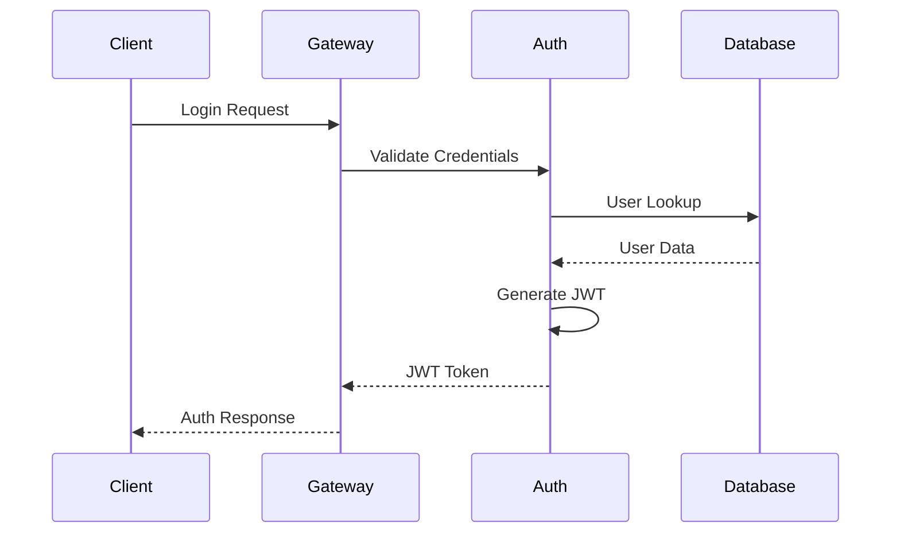

# Neo Service Layer - System Design Specification

## Executive Summary

The Neo Service Layer is a comprehensive blockchain-agnostic service platform that provides secure, scalable, and enterprise-ready services for Neo N3 and Neo X ecosystems. This document outlines the complete system design, architecture patterns, and technical specifications.

## System Architecture

### 1. Layered Architecture

```
┌─────────────────────────────────────────────────────────────┐
│                    Presentation Layer                       │
├─────────────────────────────────────────────────────────────┤
│  API Gateway    │  Web UI      │  GraphQL     │  REST APIs  │
└─────────────────────────────────────────────────────────────┘
┌─────────────────────────────────────────────────────────────┐
│                    Application Layer                        │
├─────────────────────────────────────────────────────────────┤
│  Services       │  CQRS        │  Event Bus   │  Orchestr.  │
│  - Auth         │  - Commands  │  - RabbitMQ  │  - Saga     │
│  - Blockchain   │  - Queries   │  - Events    │  - Workflow │
│  - AI/ML        │  - Handlers  │  - Pub/Sub   │  - Circuit  │
│  - Crypto       │  - Dispatch  │  - Streaming │  - Breaker  │
└─────────────────────────────────────────────────────────────┘
┌─────────────────────────────────────────────────────────────┐
│                    Domain Layer                             │
├─────────────────────────────────────────────────────────────┤
│  Aggregates     │  Entities    │  Value Obj.  │  Domain Svc │
│  - User         │  - Account   │  - UserId    │  - Password │
│  - Contract     │  - Key       │  - Email     │  - Crypto   │
│  - Transaction  │  - Vote      │  - Hash      │  - Valid.   │
└─────────────────────────────────────────────────────────────┘
┌─────────────────────────────────────────────────────────────┐
│                    Infrastructure Layer                     │
├─────────────────────────────────────────────────────────────┤
│  Data Access    │  External    │  TEE/SGX     │  Blockchain │
│  - PostgreSQL   │  - Redis     │  - Occlum    │  - Neo N3   │
│  - Entity FW    │  - RabbitMQ  │  - Intel SGX │  - Neo X    │
│  - Unit of Work │  - HTTP      │  - Attest.   │  - RPC      │
└─────────────────────────────────────────────────────────────┘
```

### 2. Core Design Patterns

#### Domain-Driven Design (DDD)
- **Bounded Contexts**: Clear service boundaries with autonomous teams
- **Aggregates**: Consistency boundaries for business operations
- **Value Objects**: Immutable data structures with behavior
- **Domain Events**: Inter-aggregate communication mechanism

#### CQRS (Command Query Responsibility Segregation)
- **Commands**: Write operations with business validation
- **Queries**: Read operations optimized for performance
- **Event Sourcing**: Complete audit trail of state changes
- **Read Models**: Optimized projections for different use cases

#### Microservices Architecture
- **Service Autonomy**: Independent deployment and scaling
- **API-First Design**: Contract-driven development
- **Fault Isolation**: Circuit breaker and bulkhead patterns
- **Distributed Tracing**: End-to-end observability

## Component Design

### 3. Service Categories

#### 3.1 Core Services
- **Authentication Service**: JWT-based auth with MFA support
- **Configuration Service**: Centralized configuration management
- **Health Service**: System health monitoring and diagnostics
- **Monitoring Service**: Metrics collection and alerting

#### 3.2 Blockchain Services
- **Smart Contracts Service**: Contract deployment and interaction
- **Oracle Service**: External data feeds integration
- **Cross-Chain Service**: Inter-blockchain communication
- **Proof of Reserve Service**: Asset backing verification

#### 3.3 Security Services
- **Key Management Service**: Cryptographic key lifecycle
- **Secrets Management**: Secure credential storage
- **Zero Knowledge Service**: Privacy-preserving computations
- **Network Security Service**: Firewall and threat detection

#### 3.4 Advanced Services
- **AI/ML Services**: Pattern recognition and prediction
- **Fair Ordering Service**: MEV protection mechanisms
- **Voting Service**: Governance and decision making
- **Social Recovery Service**: Account recovery mechanisms

#### 3.5 Infrastructure Services
- **Storage Service**: Encrypted data persistence
- **Backup Service**: Data backup and restoration
- **Notification Service**: Multi-channel messaging
- **Event Subscription Service**: Real-time event streaming

### 4. Trusted Execution Environment (TEE) Integration

#### 4.1 SGX Architecture
```
┌─────────────────────────────────────────────────────────────┐
│                    Application Layer                        │
└─────────────────────────────────────────────────────────────┘
┌─────────────────────────────────────────────────────────────┐
│                    Enclave Interface                        │
│  IEnclaveWrapper  │  IAttestation  │  IEnclaveStorage      │
└─────────────────────────────────────────────────────────────┘
┌─────────────────────────────────────────────────────────────┐
│                    Occlum LibOS                             │
│  JavaScript VM    │  File System   │  Network Stack        │
└─────────────────────────────────────────────────────────────┘
┌─────────────────────────────────────────────────────────────┐
│                    Intel SGX                                │
│  Secure Memory    │  Attestation   │  Crypto Acceleration  │
└─────────────────────────────────────────────────────────────┘
```

#### 4.2 Confidential Computing Features
- **Remote Attestation**: Verify enclave integrity and authenticity
- **Sealed Storage**: Hardware-protected data persistence
- **Secure Communication**: End-to-end encrypted channels
- **Code Protection**: Intellectual property protection

## API Design

### 5. RESTful API Architecture

#### 5.1 API Design Principles
- **Resource-Oriented**: REST compliance with proper HTTP verbs
- **Versioning**: URL-based versioning (v1, v2) for backward compatibility
- **Pagination**: Cursor-based pagination for large datasets
- **Rate Limiting**: Token bucket algorithm with different tiers
- **Content Negotiation**: JSON primary, with protocol buffer support

#### 5.2 Authentication & Authorization
```http
Authorization: Bearer <JWT_TOKEN>
X-API-Key: <API_KEY>
X-Request-ID: <UUID>
```

#### 5.3 Standard Response Format
```json
{
  "success": true,
  "data": {},
  "metadata": {
    "timestamp": "2025-01-23T10:30:00Z",
    "requestId": "uuid",
    "pagination": {
      "cursor": "base64_encoded_cursor",
      "hasMore": true,
      "limit": 100
    }
  },
  "errors": []
}
```

#### 5.4 Error Handling
```json
{
  "success": false,
  "data": null,
  "errors": [{
    "code": "VALIDATION_FAILED",
    "message": "Invalid input data",
    "field": "email",
    "details": {}
  }]
}
```

### 6. GraphQL Schema Design

#### 6.1 Type System
```graphql
type Query {
  user(id: ID!): User
  users(filter: UserFilter, pagination: PaginationInput): UserConnection
  blockchain(network: BlockchainNetwork!): BlockchainInfo
}

type Mutation {
  createUser(input: CreateUserInput!): CreateUserPayload
  updateUser(id: ID!, input: UpdateUserInput!): UpdateUserPayload
  deleteUser(id: ID!): DeleteUserPayload
}

type Subscription {
  userUpdated(id: ID!): User
  blockchainEvents(network: BlockchainNetwork!): BlockchainEvent
  systemNotifications: SystemNotification
}
```

## Database Design

### 7. Data Architecture

#### 7.1 PostgreSQL Schema Design

```sql
-- Core Schemas
CREATE SCHEMA authentication;
CREATE SCHEMA blockchain;
CREATE SCHEMA confidential;
CREATE SCHEMA monitoring;
CREATE SCHEMA audit;

-- User Management
CREATE TABLE authentication.users (
    id UUID PRIMARY KEY DEFAULT gen_random_uuid(),
    username VARCHAR(50) UNIQUE NOT NULL,
    email VARCHAR(255) UNIQUE NOT NULL,
    password_hash VARCHAR(255) NOT NULL,
    mfa_enabled BOOLEAN DEFAULT false,
    created_at TIMESTAMPTZ DEFAULT NOW(),
    updated_at TIMESTAMPTZ DEFAULT NOW(),
    version INTEGER DEFAULT 0
);

-- Key Management
CREATE TABLE confidential.keys (
    id UUID PRIMARY KEY DEFAULT gen_random_uuid(),
    user_id UUID REFERENCES authentication.users(id),
    key_type VARCHAR(20) NOT NULL,
    public_key TEXT NOT NULL,
    encrypted_private_key TEXT NOT NULL,
    curve VARCHAR(20) DEFAULT 'secp256k1',
    created_at TIMESTAMPTZ DEFAULT NOW(),
    expires_at TIMESTAMPTZ,
    status VARCHAR(20) DEFAULT 'active'
);

-- Blockchain Transactions
CREATE TABLE blockchain.transactions (
    id UUID PRIMARY KEY DEFAULT gen_random_uuid(),
    network VARCHAR(10) NOT NULL,
    tx_hash VARCHAR(66) UNIQUE NOT NULL,
    from_address VARCHAR(42) NOT NULL,
    to_address VARCHAR(42),
    value DECIMAL(78,0),
    gas_used BIGINT,
    block_number BIGINT,
    block_hash VARCHAR(66),
    status VARCHAR(20),
    created_at TIMESTAMPTZ DEFAULT NOW()
);
```

#### 7.2 Event Sourcing Tables

```sql
-- Event Store
CREATE TABLE audit.events (
    id UUID PRIMARY KEY DEFAULT gen_random_uuid(),
    aggregate_id UUID NOT NULL,
    aggregate_type VARCHAR(100) NOT NULL,
    event_type VARCHAR(100) NOT NULL,
    event_data JSONB NOT NULL,
    event_version INTEGER NOT NULL,
    aggregate_version INTEGER NOT NULL,
    created_at TIMESTAMPTZ DEFAULT NOW(),
    correlation_id UUID,
    causation_id UUID,
    initiated_by VARCHAR(255)
);

-- Projections
CREATE TABLE audit.snapshots (
    aggregate_id UUID PRIMARY KEY,
    aggregate_type VARCHAR(100) NOT NULL,
    aggregate_version INTEGER NOT NULL,
    snapshot_data JSONB NOT NULL,
    created_at TIMESTAMPTZ DEFAULT NOW()
);
```

### 8. Caching Strategy

#### 8.1 Multi-Level Caching
- **L1 Cache**: In-memory (IMemoryCache) for frequent data
- **L2 Cache**: Redis distributed cache for session data
- **L3 Cache**: CDN for static assets and API responses

#### 8.2 Cache Patterns
- **Cache-Aside**: Application manages cache manually
- **Write-Through**: Write to cache and database simultaneously
- **Write-Behind**: Asynchronous database updates
- **Refresh-Ahead**: Proactive cache refresh before expiration

## Security Design

### 9. Security Architecture

#### 9.1 Authentication Flow


#### 9.2 Authorization Model
- **Role-Based Access Control (RBAC)**: Hierarchical permissions
- **Attribute-Based Access Control (ABAC)**: Context-aware decisions
- **Policy-Based Authorization**: Centralized policy engine
- **Resource-Level Permissions**: Fine-grained access control

#### 9.3 Security Controls
- **Input Validation**: Comprehensive sanitization and validation
- **Rate Limiting**: DDoS protection and abuse prevention
- **Encryption**: AES-256-GCM for data at rest, TLS 1.3 in transit
- **Key Rotation**: Automated cryptographic key lifecycle
- **Audit Logging**: Immutable audit trail for all operations

## Performance Design

### 10. Scalability Patterns

#### 10.1 Horizontal Scaling
- **Load Balancing**: Round-robin with health checks
- **Auto-Scaling**: CPU/memory-based scaling policies
- **Database Sharding**: Partition data across multiple nodes
- **Read Replicas**: Separate read and write workloads

#### 10.2 Performance Optimization
- **Connection Pooling**: Efficient database connections
- **Query Optimization**: Indexed queries with execution plans
- **Compression**: gzip/brotli for API responses
- **CDN Integration**: Global content delivery
- **Async Processing**: Non-blocking I/O operations

### 11. Monitoring & Observability

#### 11.1 Metrics Collection
- **Application Metrics**: Custom business metrics
- **System Metrics**: CPU, memory, disk, network
- **Database Metrics**: Query performance, connection pools
- **Blockchain Metrics**: Transaction throughput, gas usage

#### 11.2 Distributed Tracing
- **OpenTelemetry**: Standardized observability framework
- **Jaeger**: Distributed tracing visualization
- **Correlation IDs**: Request tracking across services
- **Span Attributes**: Rich contextual metadata

#### 11.3 Alerting Strategy
- **SLA Monitoring**: Service level objective tracking
- **Anomaly Detection**: ML-based pattern recognition
- **Escalation Policies**: Tiered notification system
- **Runbook Integration**: Automated remediation procedures

## Deployment Architecture

### 12. Infrastructure Design

#### 12.1 Container Orchestration
```yaml
# Kubernetes Deployment Example
apiVersion: apps/v1
kind: Deployment
metadata:
  name: neo-service-layer-api
spec:
  replicas: 3
  strategy:
    type: RollingUpdate
    rollingUpdate:
      maxUnavailable: 1
      maxSurge: 1
  template:
    spec:
      containers:
      - name: api
        image: neo-service-layer:latest
        ports:
        - containerPort: 8080
        env:
        - name: DATABASE_CONNECTION_STRING
          valueFrom:
            secretKeyRef:
              name: database-secret
              key: connection-string
        resources:
          requests:
            cpu: 200m
            memory: 512Mi
          limits:
            cpu: 1000m
            memory: 1Gi
        livenessProbe:
          httpGet:
            path: /health/live
            port: 8080
          initialDelaySeconds: 30
          periodSeconds: 10
        readinessProbe:
          httpGet:
            path: /health/ready
            port: 8080
          initialDelaySeconds: 5
          periodSeconds: 5
```

#### 12.2 Service Mesh Integration
- **Istio**: Traffic management and security policies
- **mTLS**: Mutual TLS for service-to-service communication
- **Circuit Breakers**: Fault tolerance and resilience
- **Canary Deployments**: Gradual rollout strategies

## Quality Attributes

### 13. Non-Functional Requirements

#### 13.1 Performance
- **Response Time**: < 200ms for API calls, < 2s for complex operations
- **Throughput**: 10,000 requests/second sustained load
- **Concurrent Users**: 100,000 active users
- **Database**: < 50ms query response time

#### 13.2 Reliability
- **Availability**: 99.9% uptime (8.7 hours downtime/year)
- **Fault Tolerance**: Graceful degradation under load
- **Data Durability**: 99.999999999% (11 9's) data retention
- **Recovery Time**: < 5 minutes for critical services

#### 13.3 Security
- **Authentication**: Multi-factor authentication mandatory
- **Authorization**: Role-based access control
- **Encryption**: End-to-end encryption for sensitive data
- **Compliance**: SOC 2 Type II, ISO 27001 standards

#### 13.4 Scalability
- **Horizontal Scaling**: Auto-scaling based on metrics
- **Data Partitioning**: Sharding strategy for large datasets
- **Caching**: Multi-level caching for performance
- **CDN**: Global content delivery network

## Technology Stack

### 14. Development Technologies

#### 14.1 Backend
- **.NET 9.0**: Primary development framework
- **ASP.NET Core**: Web API and GraphQL endpoints
- **Entity Framework Core**: ORM for database operations
- **MediatR**: CQRS and mediator pattern implementation
- **FluentValidation**: Input validation library
- **Serilog**: Structured logging framework

#### 14.2 Databases
- **PostgreSQL**: Primary relational database
- **Redis**: Distributed caching and session storage
- **RabbitMQ**: Message queue for event-driven architecture
- **TimescaleDB**: Time-series data for metrics

#### 14.3 Infrastructure
- **Docker**: Containerization platform
- **Kubernetes**: Container orchestration
- **Helm**: Kubernetes package manager
- **Terraform**: Infrastructure as code
- **GitHub Actions**: CI/CD pipeline automation

#### 14.4 Monitoring
- **Prometheus**: Metrics collection and storage
- **Grafana**: Metrics visualization and dashboards
- **Jaeger**: Distributed tracing system
- **ELK Stack**: Centralized logging (Elasticsearch, Logstash, Kibana)

## Conclusion

The Neo Service Layer provides a robust, scalable, and secure foundation for blockchain applications. The design emphasizes:

1. **Modularity**: Clean separation of concerns with DDD patterns
2. **Scalability**: Horizontal scaling with microservices architecture  
3. **Security**: Defense-in-depth with TEE/SGX integration
4. **Reliability**: Fault-tolerant design with circuit breakers
5. **Observability**: Comprehensive monitoring and tracing
6. **Performance**: Multi-level caching and optimization strategies

This architecture supports enterprise-grade blockchain applications while maintaining flexibility for future enhancements and integrations.