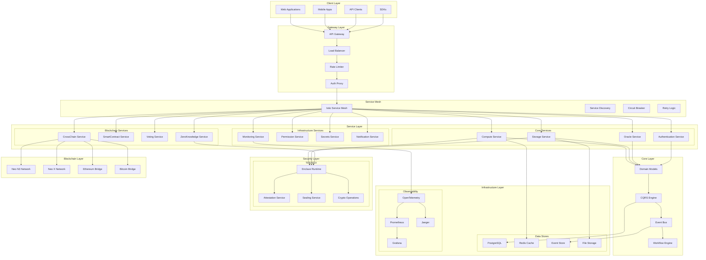
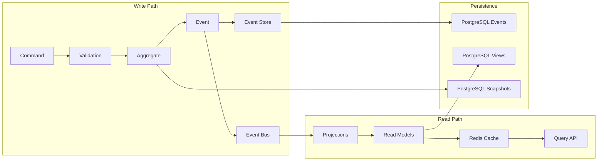
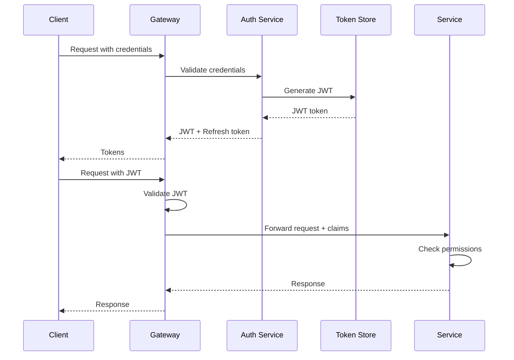

# Neo Service Layer - System Architecture Design

## 1. Executive Summary

The Neo Service Layer is a comprehensive enterprise blockchain service platform designed with a microservices architecture, hardware security through Intel SGX enclaves, and multi-chain blockchain integration. This document provides the complete architectural design, component specifications, and implementation guidelines.

## 2. System Architecture Overview

### 2.1 High-Level Architecture



### 2.2 Architecture Principles

1. **Microservices First**: Each service is independently deployable and scalable
2. **Security by Design**: Zero-trust architecture with defense in depth
3. **Event-Driven**: Asynchronous communication through event bus
4. **Cloud Native**: Container-based deployment with Kubernetes orchestration
5. **Observability**: Comprehensive monitoring, logging, and tracing
6. **Resilience**: Circuit breakers, retries, and graceful degradation
7. **Performance**: Sub-10ms latency for cached operations, 10,000+ TPS

## 3. Component Design

### 3.1 API Gateway Architecture

```yaml
apiVersion: networking.k8s.io/v1
kind: Ingress
metadata:
  name: neo-service-layer-gateway
spec:
  ingressClassName: nginx
  rules:
    - host: api.neo-service.io
      http:
        paths:
          - path: /auth
            pathType: Prefix
            backend:
              service:
                name: authentication-service
                port:
                  number: 8080
          - path: /compute
            pathType: Prefix
            backend:
              service:
                name: compute-service
                port:
                  number: 8081
          - path: /storage
            pathType: Prefix
            backend:
              service:
                name: storage-service
                port:
                  number: 8082
```

**Key Features:**
- Request routing and load balancing
- Rate limiting (10,000 req/min per client)
- JWT validation and authorization
- Request/response transformation
- API versioning support
- WebSocket support for real-time updates

### 3.2 Service Mesh Configuration

```yaml
apiVersion: v1
kind: ConfigMap
metadata:
  name: istio-service-mesh-config
data:
  mesh: |
    defaultConfig:
      proxyStatsMatcher:
        inclusionRegexps:
        - ".*outlier_detection.*"
        - ".*circuit_breaker.*"
        - ".*retry.*"
      holdApplicationUntilProxyStarts: true
    defaultProviders:
      metrics:
      - prometheus
      tracing:
      - jaeger
    extensionProviders:
    - name: prometheus
      prometheus:
        service: prometheus.istio-system.svc.cluster.local
        port: 9090
    - name: jaeger
      envoyExtAuthzHttp:
        service: jaeger-collector.istio-system.svc.cluster.local
        port: 14268
```

### 3.3 Microservice Template Design

```csharp
namespace NeoServiceLayer.Services.Template
{
    /// <summary>
    /// Base template for all microservices
    /// </summary>
    public abstract class MicroserviceBase : ServiceBase, IService
    {
        private readonly ILogger<MicroserviceBase> _logger;
        private readonly IConfiguration _configuration;
        private readonly IEventBus _eventBus;
        private readonly IMetricsCollector _metrics;
        private readonly IHealthCheck _healthCheck;
        
        protected MicroserviceBase(
            string serviceName,
            ILogger<MicroserviceBase> logger,
            IConfiguration configuration,
            IEventBus eventBus,
            IMetricsCollector metrics)
        {
            _logger = logger;
            _configuration = configuration;
            _eventBus = eventBus;
            _metrics = metrics;
            _healthCheck = new ServiceHealthCheck(this);
        }
        
        // Service lifecycle methods
        protected override async Task<bool> OnInitializeAsync()
        {
            await RegisterServiceDiscovery();
            await InitializeMetrics();
            await SubscribeToEvents();
            return true;
        }
        
        // Health check implementation
        protected override async Task<ServiceHealth> OnGetHealthAsync()
        {
            var checks = new List<HealthCheckResult>
            {
                await CheckDatabaseConnection(),
                await CheckCacheConnection(),
                await CheckEventBusConnection(),
                await CheckEnclaveStatus()
            };
            
            return checks.All(c => c.IsHealthy) 
                ? ServiceHealth.Healthy 
                : ServiceHealth.Degraded;
        }
        
        // Resilience patterns
        protected async Task<T> ExecuteWithResilience<T>(
            Func<Task<T>> operation,
            ResiliencePolicy policy = null)
        {
            policy ??= ResiliencePolicy.Default;
            
            return await Policy
                .Handle<Exception>()
                .WaitAndRetryAsync(
                    policy.RetryCount,
                    retryAttempt => TimeSpan.FromSeconds(Math.Pow(2, retryAttempt)),
                    onRetry: (exception, timeSpan, retryCount, context) =>
                    {
                        _logger.LogWarning(
                            "Retry {RetryCount} after {TimeSpan}s: {Exception}",
                            retryCount, timeSpan.TotalSeconds, exception.Message);
                        _metrics.IncrementCounter("service.retry", 
                            new[] { ("service", ServiceName), ("retry", retryCount.ToString()) });
                    })
                .ExecuteAsync(operation);
        }
    }
}
```

## 4. Enclave Computing Architecture

### 4.1 SGX Enclave Design

```csharp
namespace NeoServiceLayer.Tee.Enclave
{
    /// <summary>
    /// Intel SGX Enclave implementation for secure computing
    /// </summary>
    public class SecureEnclaveService : EnclaveServiceBase
    {
        private IntPtr _enclaveHandle;
        private readonly byte[] _sealingKey;
        
        public override async Task<bool> OnInitializeEnclaveAsync()
        {
            // Load enclave binary
            _enclaveHandle = SGX.CreateEnclave(
                "NeoServiceLayer.Enclave.signed.dll",
                SGX_DEBUG_FLAG,
                out var token);
            
            // Perform remote attestation
            var attestationReport = await PerformRemoteAttestation();
            if (!await VerifyAttestation(attestationReport))
            {
                throw new SecurityException("Enclave attestation failed");
            }
            
            // Derive sealing key
            _sealingKey = await DeriveEnclaveKey("SEALING_KEY");
            
            return true;
        }
        
        public override async Task<byte[]> SecureCompute(
            string operation, 
            byte[] input,
            Dictionary<string, object> parameters)
        {
            // Marshal data into enclave
            var ecallResult = await ExecuteEcall(
                _enclaveHandle,
                "secure_compute",
                new SecureComputeParams
                {
                    Operation = operation,
                    Input = input,
                    Parameters = parameters
                });
            
            // Verify computation integrity
            if (!VerifyMac(ecallResult.Data, ecallResult.Mac))
            {
                throw new SecurityException("Computation integrity check failed");
            }
            
            return ecallResult.Data;
        }
        
        public async Task<SealedData> SealData(byte[] data)
        {
            var sealed = await ExecuteEcall(
                _enclaveHandle,
                "seal_data",
                new SealParams
                {
                    Data = data,
                    Policy = SealingPolicy.MRENCLAVE
                });
            
            return new SealedData
            {
                Blob = sealed.SealedBlob,
                Mac = sealed.Mac,
                AdditionalData = sealed.AdditionalData
            };
        }
    }
}
```

### 4.2 Enclave Security Model

```
┌─────────────────────────────────────────┐
│          Untrusted Environment          │
│                                         │
│  ┌──────────────────────────────────┐  │
│  │     Application Runtime          │  │
│  │  - Service Logic                 │  │
│  │  - Network I/O                   │  │
│  │  - File System Access            │  │
│  └────────────┬─────────────────────┘  │
│               │ ECALL/OCALL             │
│  ┌────────────▼─────────────────────┐  │
│  │    Enclave Bridge Interface      │  │
│  └────────────┬─────────────────────┘  │
└───────────────┼─────────────────────────┘
                │
┌───────────────▼─────────────────────────┐
│         Trusted Enclave (SGX)          │
│                                         │
│  ┌──────────────────────────────────┐  │
│  │     Secure Processing            │  │
│  │  - Cryptographic Operations      │  │
│  │  - Key Management                │  │
│  │  - Sensitive Data Processing     │  │
│  └──────────────────────────────────┘  │
│                                         │
│  ┌──────────────────────────────────┐  │
│  │     Attestation Service          │  │
│  │  - Remote Attestation            │  │
│  │  - Quote Generation              │  │
│  │  - Platform Verification         │  │
│  └──────────────────────────────────┘  │
│                                         │
│  ┌──────────────────────────────────┐  │
│  │     Sealing Service              │  │
│  │  - Data Encryption               │  │
│  │  - Key Derivation                │  │
│  │  - Secure Storage                │  │
│  └──────────────────────────────────┘  │
└─────────────────────────────────────────┘
```

## 5. Blockchain Integration Architecture

### 5.1 Multi-Chain Abstraction Layer

```csharp
namespace NeoServiceLayer.Blockchain
{
    public interface IBlockchainAdapter
    {
        Task<Transaction> SendTransactionAsync(TransactionRequest request);
        Task<Block> GetBlockAsync(string blockHash);
        Task<Account> GetAccountAsync(string address);
        Task<SmartContract> DeployContractAsync(ContractDeployment deployment);
        IAsyncEnumerable<Event> SubscribeToEventsAsync(EventFilter filter);
    }
    
    public class MultiChainService : IMultiChainService
    {
        private readonly Dictionary<BlockchainType, IBlockchainAdapter> _adapters;
        
        public MultiChainService()
        {
            _adapters = new Dictionary<BlockchainType, IBlockchainAdapter>
            {
                [BlockchainType.NeoN3] = new NeoN3Adapter(),
                [BlockchainType.NeoX] = new NeoXAdapter(),
                [BlockchainType.Ethereum] = new EthereumAdapter(),
                [BlockchainType.Bitcoin] = new BitcoinAdapter()
            };
        }
        
        public async Task<CrossChainTransfer> InitiateCrossChainTransfer(
            BlockchainType sourceChain,
            BlockchainType targetChain,
            TransferRequest request)
        {
            // Lock assets on source chain
            var lockTx = await _adapters[sourceChain]
                .SendTransactionAsync(new TransactionRequest
                {
                    Method = "lock",
                    Parameters = new[] { request.Amount, request.Asset }
                });
            
            // Wait for confirmation
            await WaitForConfirmation(sourceChain, lockTx.Hash);
            
            // Generate proof
            var proof = await GenerateCrossChainProof(lockTx);
            
            // Mint on target chain
            var mintTx = await _adapters[targetChain]
                .SendTransactionAsync(new TransactionRequest
                {
                    Method = "mint",
                    Parameters = new[] { request.Recipient, request.Amount, proof }
                });
            
            return new CrossChainTransfer
            {
                SourceTx = lockTx,
                TargetTx = mintTx,
                Status = TransferStatus.Completed
            };
        }
    }
}
```

### 5.2 Smart Contract Integration

```csharp
namespace NeoServiceLayer.SmartContracts
{
    public class SmartContractService : ISmartContractService
    {
        private readonly IBlockchainAdapter _blockchain;
        private readonly ICompilerService _compiler;
        private readonly IVerificationService _verifier;
        
        public async Task<DeploymentResult> DeployContract(
            ContractSource source,
            DeploymentOptions options)
        {
            // Compile contract
            var compiled = await _compiler.CompileAsync(source);
            
            // Verify bytecode
            var verification = await _verifier.VerifyAsync(compiled.Bytecode);
            if (!verification.IsValid)
            {
                throw new InvalidOperationException(
                    $"Contract verification failed: {verification.Errors}");
            }
            
            // Estimate deployment cost
            var gasCost = await EstimateDeploymentGas(compiled);
            
            // Deploy to blockchain
            var deployment = await _blockchain.DeployContractAsync(
                new ContractDeployment
                {
                    Bytecode = compiled.Bytecode,
                    ABI = compiled.ABI,
                    Constructor = options.ConstructorParams,
                    GasLimit = gasCost * 1.2m // 20% buffer
                });
            
            // Register contract
            await RegisterContract(deployment.Address, compiled.ABI);
            
            return new DeploymentResult
            {
                Address = deployment.Address,
                TransactionHash = deployment.TransactionHash,
                GasUsed = deployment.GasUsed
            };
        }
    }
}
```

## 6. Data Architecture

### 6.1 Data Flow Design



### 6.2 CQRS Implementation

```csharp
namespace NeoServiceLayer.Core.CQRS
{
    // Command side
    public class CreateOrderCommand : ICommand
    {
        public Guid OrderId { get; set; }
        public string CustomerId { get; set; }
        public List<OrderItem> Items { get; set; }
    }
    
    public class CreateOrderCommandHandler : ICommandHandler<CreateOrderCommand>
    {
        private readonly IEventStore _eventStore;
        private readonly IEventBus _eventBus;
        
        public async Task<CommandResult> HandleAsync(CreateOrderCommand command)
        {
            // Load aggregate
            var order = await _eventStore.LoadAggregate<Order>(command.OrderId);
            
            // Execute business logic
            order.Create(command.CustomerId, command.Items);
            
            // Get uncommitted events
            var events = order.GetUncommittedEvents();
            
            // Persist events
            await _eventStore.SaveEvents(command.OrderId, events);
            
            // Publish events
            foreach (var evt in events)
            {
                await _eventBus.PublishAsync(evt);
            }
            
            return CommandResult.Success(command.OrderId);
        }
    }
    
    // Query side
    public class OrderProjection : IProjection
    {
        private readonly IReadModelStore _store;
        
        public async Task Handle(OrderCreatedEvent evt)
        {
            var readModel = new OrderReadModel
            {
                Id = evt.OrderId,
                CustomerId = evt.CustomerId,
                Items = evt.Items,
                Status = "Created",
                CreatedAt = evt.Timestamp
            };
            
            await _store.SaveAsync(readModel);
        }
    }
}
```

## 7. Security Architecture

### 7.1 Zero Trust Security Model

```yaml
apiVersion: security.istio.io/v1beta1
kind: AuthorizationPolicy
metadata:
  name: zero-trust-policy
spec:
  selector:
    matchLabels:
      app: neo-service
  action: ALLOW
  rules:
  - from:
    - source:
        principals: ["cluster.local/ns/default/sa/api-gateway"]
    to:
    - operation:
        methods: ["GET", "POST"]
    when:
    - key: request.auth.claims[iss]
      values: ["https://auth.neo-service.io"]
    - key: request.auth.claims[scope]
      values: ["api:access"]
```

### 7.2 Authentication & Authorization Flow



## 8. Monitoring & Observability

### 8.1 Metrics Architecture

```csharp
namespace NeoServiceLayer.Observability
{
    public class MetricsCollector : IMetricsCollector
    {
        private readonly MeterProvider _meterProvider;
        private readonly Meter _meter;
        
        public MetricsCollector()
        {
            _meterProvider = Sdk.CreateMeterProviderBuilder()
                .AddMeter("NeoServiceLayer.*")
                .AddPrometheusExporter()
                .AddOtlpExporter(options =>
                {
                    options.Endpoint = new Uri("http://otel-collector:4317");
                })
                .Build();
            
            _meter = new Meter("NeoServiceLayer.Metrics", "1.0.0");
        }
        
        public void RecordLatency(string operation, double milliseconds, TagList tags)
        {
            var histogram = _meter.CreateHistogram<double>(
                "operation.duration",
                unit: "ms",
                description: "Operation duration in milliseconds");
            
            histogram.Record(milliseconds, tags);
        }
        
        public void IncrementCounter(string name, TagList tags)
        {
            var counter = _meter.CreateCounter<long>(
                name,
                description: $"Count of {name} events");
            
            counter.Add(1, tags);
        }
    }
}
```

### 8.2 Distributed Tracing

```csharp
public class TracingMiddleware
{
    private readonly RequestDelegate _next;
    private readonly Tracer _tracer;
    
    public async Task InvokeAsync(HttpContext context)
    {
        using var activity = _tracer.StartActiveSpan($"{context.Request.Method} {context.Request.Path}");
        
        try
        {
            // Add trace context
            activity.SetAttribute("http.method", context.Request.Method);
            activity.SetAttribute("http.url", context.Request.Path);
            activity.SetAttribute("http.scheme", context.Request.Scheme);
            
            await _next(context);
            
            activity.SetAttribute("http.status_code", context.Response.StatusCode);
        }
        catch (Exception ex)
        {
            activity.RecordException(ex);
            activity.SetStatus(Status.Error);
            throw;
        }
    }
}
```

## 9. Deployment Architecture

### 9.1 Kubernetes Deployment

```yaml
apiVersion: apps/v1
kind: Deployment
metadata:
  name: compute-service
  namespace: neo-service-layer
spec:
  replicas: 3
  selector:
    matchLabels:
      app: compute-service
  template:
    metadata:
      labels:
        app: compute-service
        version: v1
      annotations:
        prometheus.io/scrape: "true"
        prometheus.io/port: "9090"
    spec:
      serviceAccountName: compute-service
      containers:
      - name: compute-service
        image: neo-service/compute:1.0.0
        ports:
        - containerPort: 8080
          name: http
        - containerPort: 9090
          name: metrics
        env:
        - name: ASPNETCORE_ENVIRONMENT
          value: "Production"
        - name: SGX_ENABLED
          value: "true"
        resources:
          requests:
            memory: "512Mi"
            cpu: "250m"
            sgx.intel.com/enclave: 1
          limits:
            memory: "1Gi"
            cpu: "1000m"
            sgx.intel.com/enclave: 1
        livenessProbe:
          httpGet:
            path: /health/live
            port: 8080
          initialDelaySeconds: 30
          periodSeconds: 10
        readinessProbe:
          httpGet:
            path: /health/ready
            port: 8080
          initialDelaySeconds: 5
          periodSeconds: 5
        volumeMounts:
        - name: config
          mountPath: /app/config
        - name: secrets
          mountPath: /app/secrets
          readOnly: true
      volumes:
      - name: config
        configMap:
          name: compute-service-config
      - name: secrets
        secret:
          secretName: compute-service-secrets
```

### 9.2 Horizontal Pod Autoscaling

```yaml
apiVersion: autoscaling/v2
kind: HorizontalPodAutoscaler
metadata:
  name: compute-service-hpa
spec:
  scaleTargetRef:
    apiVersion: apps/v1
    kind: Deployment
    name: compute-service
  minReplicas: 3
  maxReplicas: 10
  metrics:
  - type: Resource
    resource:
      name: cpu
      target:
        type: Utilization
        averageUtilization: 70
  - type: Resource
    resource:
      name: memory
      target:
        type: Utilization
        averageUtilization: 80
  - type: Pods
    pods:
      metric:
        name: http_requests_per_second
      target:
        type: AverageValue
        averageValue: "1000"
```

## 10. Performance Optimization

### 10.1 Caching Strategy

```csharp
namespace NeoServiceLayer.Caching
{
    public class MultiLayerCache : ICache
    {
        private readonly IMemoryCache _l1Cache;
        private readonly IDistributedCache _l2Cache;
        private readonly ICDNCache _l3Cache;
        
        public async Task<T> GetAsync<T>(string key, 
            Func<Task<T>> factory,
            CacheOptions options = null)
        {
            // L1: Memory cache (microseconds)
            if (_l1Cache.TryGetValue(key, out T value))
            {
                return value;
            }
            
            // L2: Redis cache (milliseconds)
            var redisValue = await _l2Cache.GetAsync(key);
            if (redisValue != null)
            {
                value = JsonSerializer.Deserialize<T>(redisValue);
                _l1Cache.Set(key, value, TimeSpan.FromMinutes(5));
                return value;
            }
            
            // L3: CDN cache (tens of milliseconds)
            if (options?.UseCDN == true)
            {
                var cdnValue = await _l3Cache.GetAsync(key);
                if (cdnValue != null)
                {
                    value = JsonSerializer.Deserialize<T>(cdnValue);
                    await WarmLowerCaches(key, value);
                    return value;
                }
            }
            
            // Generate value
            value = await factory();
            
            // Update all cache layers
            await SetAllCacheLayers(key, value, options);
            
            return value;
        }
    }
}
```

### 10.2 Database Query Optimization

```sql
-- Optimized query with proper indexing
CREATE INDEX CONCURRENTLY idx_transactions_user_timestamp 
ON transactions(user_id, created_at DESC) 
WHERE status = 'completed';

-- Materialized view for complex aggregations
CREATE MATERIALIZED VIEW mv_user_statistics AS
SELECT 
    u.id,
    u.username,
    COUNT(DISTINCT t.id) as transaction_count,
    SUM(t.amount) as total_volume,
    AVG(t.amount) as avg_transaction,
    MAX(t.created_at) as last_transaction
FROM users u
LEFT JOIN transactions t ON u.id = t.user_id
WHERE t.status = 'completed'
GROUP BY u.id, u.username;

CREATE UNIQUE INDEX ON mv_user_statistics(id);

-- Refresh strategy
CREATE OR REPLACE FUNCTION refresh_user_statistics()
RETURNS void AS $$
BEGIN
    REFRESH MATERIALIZED VIEW CONCURRENTLY mv_user_statistics;
END;
$$ LANGUAGE plpgsql;
```

## 11. Implementation Roadmap

### Phase 1: Foundation (Weeks 1-4)
- Set up development environment
- Implement core service template
- Establish CI/CD pipeline
- Deploy basic monitoring

### Phase 2: Core Services (Weeks 5-8)
- Implement authentication service
- Develop storage service
- Create compute service
- Set up event bus

### Phase 3: Blockchain Integration (Weeks 9-12)
- Integrate Neo N3 adapter
- Implement Neo X adapter
- Develop cross-chain service
- Create smart contract service

### Phase 4: Security & Enclave (Weeks 13-16)
- Implement SGX enclave support
- Set up attestation service
- Develop key management
- Implement zero-knowledge proofs

### Phase 5: Production Readiness (Weeks 17-20)
- Performance optimization
- Security audit
- Load testing
- Documentation completion

## 12. Conclusion

This architecture design provides a comprehensive blueprint for implementing the Neo Service Layer as a production-ready, enterprise-grade blockchain service platform. The modular microservices architecture, combined with hardware security through Intel SGX and comprehensive observability, ensures the system can meet the demanding requirements of modern blockchain applications while maintaining the highest standards of security and performance.

The design emphasizes:
- **Scalability** through microservices and horizontal scaling
- **Security** through enclaves and zero-trust architecture
- **Performance** through multi-layer caching and optimization
- **Reliability** through resilience patterns and monitoring
- **Flexibility** through multi-chain support and event-driven architecture

Following this design will result in a robust, secure, and high-performance platform capable of supporting enterprise blockchain applications at scale.