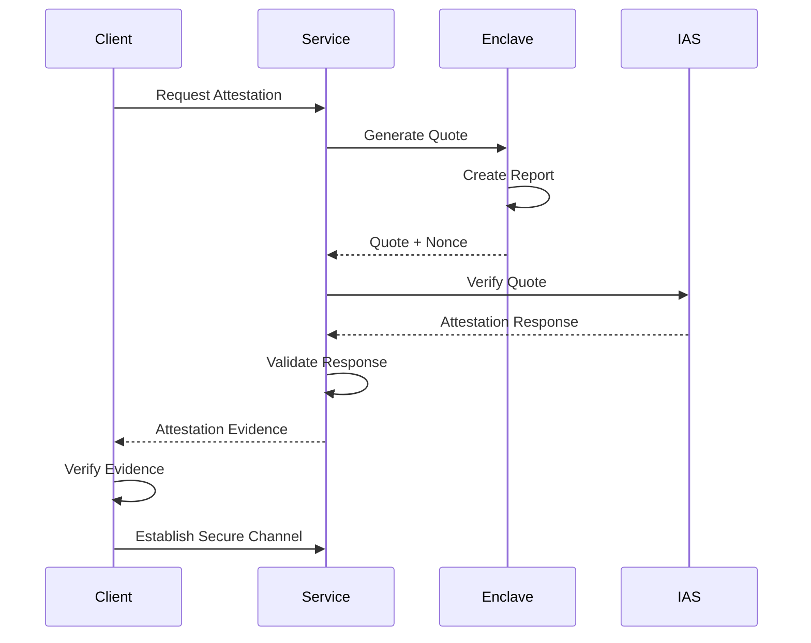

# Neo Service Layer - TEE Confidential Computing Design

## Overview

This document outlines the comprehensive design for Trusted Execution Environment (TEE) integration within the Neo Service Layer, focusing on Intel SGX implementation with Occlum LibOS for secure, confidential computing capabilities.

## Executive Summary

The Neo Service Layer implements a robust confidential computing architecture using Intel SGX enclaves to protect sensitive computations and data. The design ensures data confidentiality, integrity, and authenticity while maintaining high performance and scalability.

## Confidential Computing Architecture

### 1. High-Level Architecture

```
┌─────────────────────────────────────────────────────────────┐
│                    Application Layer                        │
├─────────────────────────────────────────────────────────────┤
│  Smart Contracts │  AI/ML Models  │  Crypto Ops  │  Storage │
└─────────────────────────────────────────────────────────────┘
┌─────────────────────────────────────────────────────────────┐
│                    Enclave Interface                        │
├─────────────────────────────────────────────────────────────┤
│  IEnclaveWrapper  │  IAttestation  │  ISecureStorage │  API  │
└─────────────────────────────────────────────────────────────┘
┌─────────────────────────────────────────────────────────────┐
│                    Occlum LibOS                             │
├─────────────────────────────────────────────────────────────┤
│  JavaScript VM    │  File System   │  Network Stack  │ Proc │
│  - V8 Engine      │  - EncFS       │  - TLS 1.3      │ Mgmt │
│  - Node.js        │  - In-Memory   │  - Secure Socks │      │
└─────────────────────────────────────────────────────────────┘
┌─────────────────────────────────────────────────────────────┐
│                    Intel SGX                                │
├─────────────────────────────────────────────────────────────┤
│  EPC Memory       │  Attestation   │  Sealing        │ PRM  │
│  - 128MB-1GB      │  - EPID/DCAP   │  - MRENCLAVE    │ Priv │
│  - Encrypted      │  - Remote      │  - MRSIGNER     │ Exec │
└─────────────────────────────────────────────────────────────┘
```

### 2. Security Boundaries

#### 2.1 Trust Zones
- **Untrusted Zone**: Application host, operating system, hypervisor
- **Trusted Zone**: SGX enclave with Occlum LibOS
- **Hardware Root of Trust**: Intel SGX processor security features

#### 2.2 Attack Surface Minimization
- **Code Attestation**: Verify enclave code integrity before execution
- **Data Sealing**: Hardware-based encryption for persistent data
- **Side-Channel Resistance**: Constant-time algorithms and data access patterns
- **Memory Protection**: Automatic encryption of enclave memory pages

## Intel SGX Implementation

### 3. Enclave Architecture

#### 3.1 Enclave Configuration
```json
{
  "enclave_config": {
    "heap_size": "512MB",
    "stack_size": "16MB",
    "thread_count": 8,
    "debug_enabled": false,
    "production_mode": true,
    "measurement": {
      "mrenclave": "calculated_at_build_time",
      "mrsigner": "production_signing_key"
    }
  }
}
```

#### 3.2 Enclave Lifecycle Management
```csharp
public interface IEnclaveManager
{
    Task<EnclaveResult> InitializeEnclaveAsync(EnclaveConfig config);
    Task<EnclaveResult> LoadApplicationAsync(string applicationPath);
    Task<EnclaveResult> AttestEnclaveAsync(AttestationRequest request);
    Task<EnclaveResult> ExecuteSecureOperationAsync(SecureOperation operation);
    Task<EnclaveResult> SealDataAsync(byte[] data, SealingPolicy policy);
    Task<byte[]> UnsealDataAsync(SealedData sealedData);
    Task DestroyEnclaveAsync();
}
```

### 4. Occlum LibOS Integration

#### 4.1 LibOS Configuration
```yaml
# Occlum.yaml
resource_limits:
  user_space_size: "1GB"
  kernel_space_heap_size: "128MB"
  kernel_space_stack_size: "8MB"
  max_num_of_threads: 64

process:
  default_stack_size: "4MB"
  default_heap_size: "256MB"

mount:
  - target: /tmp
    type: unionfs
    source: /tmp
  - target: /etc/ssl
    type: sefs
    source: ./ssl_certs

env:
  - NODE_ENV=production
  - SECURE_MODE=true
```

#### 4.2 JavaScript/Node.js Runtime
```javascript
// Secure execution environment
const SecureRuntime = {
    // Initialize secure context
    initializeSecureContext: async (config) => {
        const attestationResult = await performAttestation();
        if (!attestationResult.verified) {
            throw new Error('Attestation failed');
        }
        
        return {
            enclaveId: attestationResult.enclaveId,
            securityLevel: 'SGX_PRODUCTION',
            capabilities: ['sealing', 'attestation', 'secure_io']
        };
    },
    
    // Execute secure computation
    executeSecureComputation: async (code, data, options) => {
        const sealed = await sealInput(data);
        const result = await evaluateInSecureContext(code, sealed);
        return await unsealOutput(result);
    },
    
    // Secure key derivation
    deriveSecureKey: async (masterKey, derivationPath) => {
        const context = await getSecureContext();
        return await deriveKeyInEnclave(masterKey, derivationPath, context);
    }
};
```

### 5. Attestation Framework

#### 5.1 Remote Attestation Flow


#### 5.2 Attestation Service Implementation
```csharp
public class AttestationService : IAttestationService
{
    private readonly HttpClient _httpClient;
    private readonly ILogger<AttestationService> _logger;
    private readonly AttestationConfig _config;

    public async Task<AttestationResult> PerformRemoteAttestationAsync(
        byte[] quote, 
        AttestationRequest request)
    {
        try
        {
            // Prepare attestation request for Intel Attestation Service
            var attestationPayload = new
            {
                isvEnclaveQuote = Convert.ToBase64String(quote),
                pseManifest = request.PseManifest,
                nonce = request.Nonce
            };

            var response = await _httpClient.PostAsJsonAsync(
                _config.IasEndpoint, 
                attestationPayload);

            if (!response.IsSuccessStatusCode)
            {
                throw new AttestationException($"IAS returned {response.StatusCode}");
            }

            var result = await response.Content.ReadAsStringAsync();
            var attestationVerificationReport = JsonSerializer.Deserialize<AttestationVerificationReport>(result);

            // Validate the attestation report
            var validationResult = await ValidateAttestationReportAsync(attestationVerificationReport);
            
            return new AttestationResult
            {
                IsValid = validationResult.IsValid,
                SecurityLevel = validationResult.SecurityLevel,
                Measurements = validationResult.Measurements,
                TrustLevel = CalculateTrustLevel(validationResult),
                Evidence = attestationVerificationReport
            };
        }
        catch (Exception ex)
        {
            _logger.LogError(ex, "Remote attestation failed");
            throw new AttestationException("Remote attestation failed", ex);
        }
    }

    private async Task<ValidationResult> ValidateAttestationReportAsync(
        AttestationVerificationReport report)
    {
        // Verify report signature
        var signatureValid = await VerifyReportSignatureAsync(report);
        if (!signatureValid)
        {
            return ValidationResult.Invalid("Invalid signature");
        }

        // Check enclave measurements
        var measurementsValid = ValidateEnclaveMeasurements(report.Measurements);
        if (!measurementsValid)
        {
            return ValidationResult.Invalid("Invalid enclave measurements");
        }

        // Verify security properties
        var securityValid = ValidateSecurityProperties(report.SecurityProperties);
        if (!securityValid)
        {
            return ValidationResult.Invalid("Security requirements not met");
        }

        return ValidationResult.Valid(report.SecurityLevel);
    }
}
```

### 6. Secure Storage Design

#### 6.1 Sealing and Unsealing
```csharp
public class SecureStorageService : ISecureStorageService
{
    private readonly IEnclaveWrapper _enclaveWrapper;
    private readonly ISealingKeyProvider _sealingKeyProvider;

    public async Task<SealedData> SealDataAsync<T>(T data, SealingPolicy policy)
    {
        try
        {
            var serializedData = JsonSerializer.SerializeToUtf8Bytes(data);
            
            // Generate sealing key based on policy
            var sealingKey = await _sealingKeyProvider.GetSealingKeyAsync(policy);
            
            // Seal data in enclave
            var sealedBytes = await _enclaveWrapper.SealDataAsync(
                serializedData, 
                sealingKey, 
                policy.ToSealingFlags());

            return new SealedData
            {
                EncryptedData = sealedBytes,
                SealingPolicy = policy,
                KeyDerivationInfo = sealingKey.DerivationInfo,
                Timestamp = DateTimeOffset.UtcNow,
                Version = 1
            };
        }
        catch (Exception ex)
        {
            throw new SecureStorageException("Failed to seal data", ex);
        }
    }

    public async Task<T> UnsealDataAsync<T>(SealedData sealedData)
    {
        try
        {
            // Reconstruct sealing key
            var sealingKey = await _sealingKeyProvider.ReconstructSealingKeyAsync(
                sealedData.KeyDerivationInfo, 
                sealedData.SealingPolicy);

            // Unseal data in enclave
            var unsealedBytes = await _enclaveWrapper.UnsealDataAsync(
                sealedData.EncryptedData, 
                sealingKey);

            return JsonSerializer.Deserialize<T>(unsealedBytes);
        }
        catch (Exception ex)
        {
            throw new SecureStorageException("Failed to unseal data", ex);
        }
    }
}
```

#### 6.2 Sealing Policies
```csharp
public enum SealingPolicy
{
    MRENCLAVE,  // Bind to specific enclave version
    MRSIGNER,   // Bind to enclave signer
    HYBRID      // Combination of MRENCLAVE and MRSIGNER
}

public class SealingConfiguration
{
    public SealingPolicy DefaultPolicy { get; set; } = SealingPolicy.HYBRID;
    public bool EnableKeyRotation { get; set; } = true;
    public TimeSpan KeyRotationInterval { get; set; } = TimeSpan.FromDays(30);
    public int MaxKeyVersions { get; set; } = 5;
    public bool RequireAttestation { get; set; } = true;
}
```

### 7. Secure Communication

#### 7.1 End-to-End Encryption
```csharp
public class SecureChannelService : ISecureChannelService
{
    public async Task<SecureChannel> EstablishSecureChannelAsync(
        AttestationEvidence evidence, 
        PublicKey clientPublicKey)
    {
        // Verify client attestation
        var attestationResult = await VerifyAttestationAsync(evidence);
        if (!attestationResult.IsValid)
        {
            throw new SecurityException("Invalid attestation");
        }

        // Generate ephemeral key pair in enclave
        var enclaveKeyPair = await GenerateEphemeralKeyPairAsync();

        // Perform ECDH key exchange
        var sharedSecret = await PerformECDHAsync(
            enclaveKeyPair.PrivateKey, 
            clientPublicKey);

        // Derive channel encryption keys
        var channelKeys = await DeriveChannelKeysAsync(sharedSecret);

        return new SecureChannel
        {
            ChannelId = Guid.NewGuid(),
            EncryptionKey = channelKeys.EncryptionKey,
            MacKey = channelKeys.MacKey,
            EnclavePublicKey = enclaveKeyPair.PublicKey,
            EstablishedAt = DateTimeOffset.UtcNow,
            ExpiresAt = DateTimeOffset.UtcNow.AddHours(1)
        };
    }

    public async Task<EncryptedMessage> EncryptMessageAsync(
        SecureChannel channel, 
        byte[] message)
    {
        // Generate random IV
        var iv = await GenerateRandomBytesAsync(16);
        
        // Encrypt message using AES-256-GCM
        var (ciphertext, tag) = await EncryptAESGCMAsync(
            message, 
            channel.EncryptionKey, 
            iv);

        // Compute MAC
        var mac = await ComputeHMACAsync(
            CombineBytes(iv, ciphertext, tag), 
            channel.MacKey);

        return new EncryptedMessage
        {
            Ciphertext = ciphertext,
            IV = iv,
            Tag = tag,
            MAC = mac,
            Timestamp = DateTimeOffset.UtcNow
        };
    }
}
```

#### 7.2 Message Authentication
```csharp
public class MessageAuthenticator
{
    public async Task<AuthenticatedMessage> SignMessageAsync(
        byte[] message, 
        SigningKey signingKey)
    {
        // Create message hash
        var messageHash = await ComputeSHA256Async(message);
        
        // Sign hash with enclave signing key
        var signature = await SignInEnclaveAsync(messageHash, signingKey);
        
        // Include attestation evidence
        var attestationEvidence = await GetCurrentAttestationAsync();

        return new AuthenticatedMessage
        {
            Message = message,
            MessageHash = messageHash,
            Signature = signature,
            SigningKeyId = signingKey.KeyId,
            AttestationEvidence = attestationEvidence,
            Timestamp = DateTimeOffset.UtcNow
        };
    }

    public async Task<bool> VerifyMessageAsync(AuthenticatedMessage authenticatedMessage)
    {
        try
        {
            // Verify attestation evidence
            var attestationValid = await VerifyAttestationAsync(
                authenticatedMessage.AttestationEvidence);
            if (!attestationValid)
                return false;

            // Verify message hash
            var computedHash = await ComputeSHA256Async(authenticatedMessage.Message);
            if (!computedHash.SequenceEqual(authenticatedMessage.MessageHash))
                return false;

            // Verify signature
            return await VerifySignatureAsync(
                authenticatedMessage.MessageHash,
                authenticatedMessage.Signature,
                authenticatedMessage.SigningKeyId);
        }
        catch
        {
            return false;
        }
    }
}
```

### 8. Secure Multi-Party Computation

#### 8.1 Secure Aggregation
```csharp
public class SecureAggregationService
{
    public async Task<AggregationResult> PerformSecureAggregationAsync(
        IEnumerable<EncryptedInput> encryptedInputs,
        AggregationFunction function)
    {
        var sessionId = Guid.NewGuid();
        
        try
        {
            // Verify all inputs are properly encrypted and authenticated
            var verificationTasks = encryptedInputs.Select(VerifyInputAsync);
            var verificationResults = await Task.WhenAll(verificationTasks);
            
            if (verificationResults.Any(r => !r.IsValid))
            {
                throw new SecurityException("One or more inputs failed verification");
            }

            // Decrypt inputs in enclave
            var decryptedInputs = await DecryptInputsInEnclaveAsync(encryptedInputs);
            
            // Perform aggregation in enclave
            var aggregationResult = await PerformAggregationInEnclaveAsync(
                decryptedInputs, 
                function);

            // Generate proof of correct computation
            var computationProof = await GenerateComputationProofAsync(
                sessionId, 
                function, 
                aggregationResult);

            return new AggregationResult
            {
                SessionId = sessionId,
                Result = aggregationResult,
                ComputationProof = computationProof,
                ParticipantCount = encryptedInputs.Count(),
                Timestamp = DateTimeOffset.UtcNow
            };
        }
        catch (Exception ex)
        {
            throw new SecureComputationException(
                $"Secure aggregation failed for session {sessionId}", ex);
        }
    }
}
```

#### 8.2 Zero-Knowledge Proofs in TEE
```csharp
public class ZKProofService
{
    public async Task<ZKProof> GenerateProofAsync<T>(
        T witness, 
        Circuit circuit, 
        PublicInputs publicInputs)
    {
        try
        {
            // Load proving key in enclave
            var provingKey = await LoadProvingKeyAsync(circuit.CircuitId);
            
            // Generate proof in secure enclave
            var proof = await _enclaveWrapper.GenerateZKProofAsync(
                witness, 
                circuit, 
                publicInputs, 
                provingKey);

            // Create attestation for proof generation
            var attestation = await GenerateProofAttestationAsync(
                circuit.CircuitId, 
                publicInputs, 
                proof);

            return new ZKProof
            {
                ProofData = proof,
                PublicInputs = publicInputs,
                CircuitId = circuit.CircuitId,
                Attestation = attestation,
                GeneratedAt = DateTimeOffset.UtcNow
            };
        }
        catch (Exception ex)
        {
            throw new ZKProofException("Failed to generate ZK proof", ex);
        }
    }

    public async Task<bool> VerifyProofAsync(ZKProof zkProof, Circuit circuit)
    {
        try
        {
            // Verify attestation first
            var attestationValid = await VerifyAttestationAsync(zkProof.Attestation);
            if (!attestationValid)
                return false;

            // Load verification key
            var verificationKey = await LoadVerificationKeyAsync(circuit.CircuitId);
            
            // Verify proof
            return await _enclaveWrapper.VerifyZKProofAsync(
                zkProof.ProofData, 
                zkProof.PublicInputs, 
                verificationKey);
        }
        catch
        {
            return false;
        }
    }
}
```

### 9. Performance Optimization

#### 9.1 Enclave Memory Management
```csharp
public class EnclaveMemoryManager
{
    private readonly Dictionary<string, MemoryPool> _memoryPools;
    private readonly object _lock = new object();

    public MemoryHandle AllocateSecureMemory(int size, MemoryType type)
    {
        lock (_lock)
        {
            var poolKey = $"{type}_{GetSizeCategory(size)}";
            
            if (!_memoryPools.TryGetValue(poolKey, out var pool))
            {
                pool = CreateMemoryPool(type, GetSizeCategory(size));
                _memoryPools[poolKey] = pool;
            }

            return pool.Allocate(size);
        }
    }

    public void DeallocateSecureMemory(MemoryHandle handle)
    {
        // Zero memory before deallocation for security
        handle.ZeroMemory();
        
        lock (_lock)
        {
            var poolKey = handle.PoolKey;
            if (_memoryPools.TryGetValue(poolKey, out var pool))
            {
                pool.Deallocate(handle);
            }
        }
    }

    private MemoryPool CreateMemoryPool(MemoryType type, SizeCategory sizeCategory)
    {
        var config = new MemoryPoolConfig
        {
            InitialSize = GetInitialPoolSize(sizeCategory),
            MaxSize = GetMaxPoolSize(sizeCategory),
            AllocationAlignment = 64, // Cache line alignment
            ZeroOnAllocate = true,
            ZeroOnDeallocate = true
        };

        return new MemoryPool(type, sizeCategory, config);
    }
}
```

#### 9.2 Optimized Enclave Transitions
```csharp
public class OptimizedEnclaveService
{
    private readonly BatchProcessor<EnclaveOperation> _batchProcessor;
    private readonly OperationCache _operationCache;

    public OptimizedEnclaveService()
    {
        _batchProcessor = new BatchProcessor<EnclaveOperation>(
            batchSize: 32,
            batchTimeout: TimeSpan.FromMilliseconds(10),
            processor: ProcessBatchAsync);

        _operationCache = new OperationCache(
            maxSize: 1000,
            ttl: TimeSpan.FromMinutes(5));
    }

    public async Task<T> ExecuteOptimizedOperationAsync<T>(
        EnclaveOperation<T> operation)
    {
        // Check cache first
        var cacheKey = operation.GetCacheKey();
        if (_operationCache.TryGet(cacheKey, out T cachedResult))
        {
            return cachedResult;
        }

        // Batch similar operations
        if (operation.IsBatchable)
        {
            return await _batchProcessor.SubmitAsync(operation);
        }

        // Execute immediately for critical operations
        var result = await ExecuteInEnclaveAsync(operation);
        
        // Cache result if applicable
        if (operation.IsCacheable)
        {
            _operationCache.Set(cacheKey, result);
        }

        return result;
    }

    private async Task ProcessBatchAsync(IList<EnclaveOperation> operations)
    {
        // Sort operations by priority and type
        var sortedOps = operations.OrderBy(op => op.Priority)
                                 .ThenBy(op => op.Type)
                                 .ToList();

        // Execute batch in single enclave transition
        await ExecuteBatchInEnclaveAsync(sortedOps);
    }
}
```

### 10. Security Monitoring and Alerting

#### 10.1 Security Event Detection
```csharp
public class SecurityMonitoringService
{
    private readonly IEventPublisher _eventPublisher;
    private readonly IRiskAnalyzer _riskAnalyzer;

    public async Task MonitorEnclaveSecurityAsync()
    {
        while (!_cancellationToken.IsCancellationRequested)
        {
            try
            {
                // Check enclave integrity
                var integrityCheck = await PerformIntegrityCheckAsync();
                if (!integrityCheck.IsValid)
                {
                    await PublishSecurityEventAsync(
                        SecurityEventType.IntegrityViolation, 
                        integrityCheck);
                }

                // Monitor for side-channel attacks
                var sideChannelRisk = await _riskAnalyzer.AnalyzeSideChannelRiskAsync();
                if (sideChannelRisk.RiskLevel > RiskLevel.Medium)
                {
                    await PublishSecurityEventAsync(
                        SecurityEventType.SideChannelThreat, 
                        sideChannelRisk);
                }

                // Check for unusual access patterns
                var accessPatterns = await AnalyzeAccessPatternsAsync();
                if (accessPatterns.HasAnomalies)
                {
                    await PublishSecurityEventAsync(
                        SecurityEventType.AnomalousAccess, 
                        accessPatterns);
                }

                await Task.Delay(TimeSpan.FromSeconds(30), _cancellationToken);
            }
            catch (Exception ex)
            {
                // Log error but continue monitoring
                _logger.LogError(ex, "Security monitoring iteration failed");
            }
        }
    }

    private async Task PublishSecurityEventAsync<T>(
        SecurityEventType eventType, 
        T eventData)
    {
        var securityEvent = new SecurityEvent
        {
            EventType = eventType,
            Severity = CalculateSeverity(eventType, eventData),
            Data = eventData,
            Timestamp = DateTimeOffset.UtcNow,
            EnclaveId = await GetCurrentEnclaveIdAsync()
        };

        await _eventPublisher.PublishAsync(securityEvent);

        // Immediate action for critical events
        if (securityEvent.Severity == SecuritySeverity.Critical)
        {
            await TriggerEmergencyResponseAsync(securityEvent);
        }
    }
}
```

### 11. Configuration and Deployment

#### 11.1 Production Configuration
```yaml
# SGX Production Configuration
sgx_config:
  enclave:
    heap_size: "1GB"
    stack_size: "32MB"
    thread_count: 16
    debug: false
    production_mode: true
    
  attestation:
    service_url: "https://api.trustedservices.intel.com/sgx/dev/attestation/v4/"
    api_key_env: "IAS_API_KEY"
    trust_level: "SW_HARDENING_NEEDED"
    cache_duration: "1h"
    
  sealing:
    default_policy: "HYBRID"
    key_rotation_interval: "30d"
    max_key_versions: 10
    
  security:
    enable_side_channel_protection: true
    constant_time_operations: true
    memory_clearing: "immediate"
    attestation_frequency: "24h"

# Occlum Configuration
occlum_config:
  resource_limits:
    user_space_size: "2GB"
    kernel_heap_size: "256MB"
    max_threads: 32
    
  mount_points:
    - target: "/app"
      type: "sefs"
      source: "./app"
      readonly: true
    - target: "/tmp"
      type: "unionfs"
      source: "/tmp"
      
  environment:
    NODE_ENV: "production"
    SECURE_MODE: "true"
    LOG_LEVEL: "info"
```

#### 11.2 Docker Configuration
```dockerfile
# SGX-enabled Docker container
FROM ubuntu:20.04 as sgx-base

# Install SGX dependencies
RUN apt-get update && apt-get install -y \
    wget \
    gnupg2 \
    software-properties-common && \
    wget -qO - https://download.01.org/intel-sgx/sgx_repo/ubuntu/intel-sgx-deb.key | apt-key add - && \
    add-apt-repository "deb [arch=amd64] https://download.01.org/intel-sgx/sgx_repo/ubuntu focal main" && \
    apt-get update && apt-get install -y \
    libsgx-launch \
    libsgx-urts \
    libsgx-epid \
    libsgx-quote-ex \
    libsgx-dcap-ql

# Install Occlum
FROM sgx-base as occlum-base
RUN wget -qO - https://occlum.io/occlum-package-repos/debian/public.key | apt-key add - && \
    add-apt-repository "deb [arch=amd64] https://occlum.io/occlum-package-repos/debian focal main" && \
    apt-get update && apt-get install -y occlum

# Application layer
FROM occlum-base as app
COPY . /app
WORKDIR /app

# Build enclave
RUN occlum new instance && \
    cd instance && \
    cp -r /app/* image/ && \
    occlum build --sign-key /app/enclave-key.pem

# Runtime
EXPOSE 8080
CMD ["occlum", "run", "/app/neo-service-layer"]
```

This comprehensive TEE/SGX design provides enterprise-grade confidential computing capabilities with strong security guarantees, performance optimization, and production-ready deployment strategies.