# Secure Data Flow Component Interaction Diagrams

## Overview

This document provides comprehensive component interaction diagrams illustrating secure data flow patterns throughout the Neo Service Layer platform. These diagrams demonstrate how security controls, encryption, validation, and monitoring work together to ensure data protection at every layer.

## Architecture Layers Overview

## 1. Secure Request Processing Flow

### Complete Request Lifecycle with Security Controls

## 2. Data Encryption Flow

### Multi-Layer Data Protection

## 3. SGX Enclave Security Flow

### Trusted Execution Environment Data Processing

```mermaid
sequenceDiagram
    participant Client
    participant API as API Layer
    participant Security as Security Service
    participant SGX as SGX Service
    participant Enclave as Trusted Enclave
    participant Storage as Secure Storage
    participant Monitor as Monitoring

    Note over Client,Monitor: SGX Secure Execution Flow

    %% Request Initiation
    Client->>+API: Execute Code Request
    API->>+Security: Validate Input
    
    %% Security Validation
    Security->>Security: Input Size Check<br/>Script Validation<br/>Threat Detection
    alt Security Violation
        Security-->>API: Security Error
        API-->>Client: Request Rejected
    else Input Valid
        Security->>-API: Validation Passed
    end
    
    %% SGX Service Processing
    API->>+SGX: Prepare SGX Execution
    
    %% Enclave Initialization
    SGX->>SGX: Check SGX Availability<br/>Hardware Validation
    SGX->>+Enclave: Initialize Enclave
    
    %% Remote Attestation
    par Remote Attestation
        Enclave->>Enclave: Generate Quote
        Enclave->>SGX: Attestation Quote
        SGX->>SGX: Verify Quote<br/>Check Signatures<br/>Validate Platform
        alt Attestation Failed
            SGX-->>API: Attestation Error
            API-->>Client: Enclave Not Trusted
        end
    end
    
    %% Secure Data Sealing
    opt Data Persistence Required
        SGX->>+Storage: Seal Data Request
        Storage->>Storage: Generate Sealing Key<br/>Hardware-bound Encryption
        Storage->>-SGX: Sealed Data Blob
    end
    
    %% Secure Execution
    SGX->>Enclave: Execute JavaScript Code
    activate Enclave
    
    Note over Enclave: Trusted Execution Environment<br/>• Hardware Memory Protection<br/>• Encrypted Memory<br/>• Tamper Detection<br/>• Secure I/O
    
    Enclave->>Enclave: Input Validation<br/>Memory Allocation<br/>Script Execution<br/>Result Computation
    
    %% Error Handling in Enclave
    opt Execution Error
        Enclave->>Enclave: Secure Error Handling<br/>Memory Cleanup<br/>State Reset
    end
    
    Enclave->>-SGX: Encrypted Result
    deactivate Enclave
    
    %% Result Processing
    SGX->>SGX: Decrypt Result<br/>Validate Output<br/>Security Check
    
    %% Data Unsealing (if needed)
    opt Sealed Data Required
        SGX->>+Storage: Unseal Data Request
        Storage->>Storage: Verify Sealing Policy<br/>Hardware Validation<br/>Decrypt Data
        alt Unsealing Failed
            Storage-->>SGX: Policy Violation
        else Success
            Storage->>-SGX: Unsealed Data
        end
    end
    
    %% Response Generation
    SGX->>-API: Execution Result
    API->>API: Result Validation<br/>Response Formatting
    API->>-Client: Final Response
    
    %% Comprehensive Monitoring
    par Monitoring & Logging
        Security->>Monitor: Security Events
        SGX->>Monitor: Enclave Metrics<br/>Performance Data
        Enclave->>Monitor: Execution Logs<br/>(Encrypted)
        Storage->>Monitor: Sealing Operations<br/>Key Usage
    end
    
    Monitor->>Monitor: Correlation Analysis<br/>Threat Detection<br/>Performance Analysis

    Note over Client,Monitor: End-to-End Security<br/>Hardware-backed Trust<br/>Comprehensive Monitoring
```

## 4. Authentication and Authorization Flow

### Multi-Factor Security with JWT and Role-Based Access

## 5. Error Handling and Resilience Flow

### Comprehensive Error Management with Circuit Breakers

```mermaid
stateDiagram-v2
    [*] --> RequestReceived: Incoming Request
    
    state SecurityLayer {
        RequestReceived --> InputValidation
        InputValidation --> RateLimitCheck
        RateLimitCheck --> ThreatDetection
        
        InputValidation --> SecurityError: Invalid Input
        RateLimitCheck --> RateLimitError: Limit Exceeded
        ThreatDetection --> SecurityThreat: Threat Detected
    }
    
    state ResilienceLayer {
        ThreatDetection --> CircuitBreakerCheck: Validation Passed
        CircuitBreakerCheck --> ServiceCall: Circuit Closed
        CircuitBreakerCheck --> CircuitOpen: Circuit Open
        
        ServiceCall --> RetryLogic: Service Error
        RetryLogic --> ServiceCall: Retry Attempt
        RetryLogic --> BulkheadIsolation: Max Retries
        
        BulkheadIsolation --> FallbackResponse: Resource Isolated
        ServiceCall --> SuccessResponse: Success
    }
    
    state ErrorRecovery {
        SecurityError --> ErrorLogging
        RateLimitError --> ErrorLogging
        SecurityThreat --> SecurityAlert
        CircuitOpen --> FallbackResponse
        BulkheadIsolation --> ErrorRecovery_Internal: Resource Exhausted
        
        ErrorLogging --> ClientErrorResponse
        SecurityAlert --> BlockedResponse
        FallbackResponse --> CachedResponse
        ErrorRecovery_Internal --> PartialResponse
    }
    
    state MonitoringLayer {
        ErrorLogging --> MetricsCollection
        SecurityAlert --> AlertManager
        ServiceCall --> PerformanceMetrics
        CircuitBreakerCheck --> CircuitMetrics
        
        MetricsCollection --> DashboardUpdate
        AlertManager --> NotificationSystem
        PerformanceMetrics --> TrendAnalysis
        CircuitMetrics --> CircuitBreakerAdjustment
    }
    
    ClientErrorResponse --> [*]: 4xx Response
    BlockedResponse --> [*]: 403 Blocked
    CachedResponse --> [*]: Cached Data
    PartialResponse --> [*]: Degraded Service
    SuccessResponse --> [*]: 200 Success
    
    note right of SecurityLayer
        • Input validation against
          SQL injection, XSS, code injection
        • Rate limiting with sliding window
        • Real-time threat detection
    end note
    
    note right of ResilienceLayer
        • Circuit breaker pattern
        • Exponential backoff retry
        • Bulkhead isolation
        • Graceful degradation
    end note
    
    note right of ErrorRecovery
        • Structured error responses
        • Security incident response
        • Fallback mechanisms
        • Partial service recovery
    end note
```

## 6. Data Storage Security Flow

### Multi-Layer Storage Protection

## 7. Monitoring and Observability Flow

### Comprehensive Security Monitoring Integration

## 8. Security Incident Response Flow

### Automated Security Response and Containment

## Summary

These comprehensive component interaction diagrams illustrate:

### 🔒 **Security-First Architecture**
- Multi-layer security validation at every component interaction
- End-to-end encryption with hardware-backed SGX protection
- Comprehensive input validation and threat detection
- Real-time security monitoring and automated response

### 🏗️ **Resilient Design Patterns**
- Circuit breaker patterns for fault tolerance
- Bulkhead isolation for resource protection
- Exponential backoff retry mechanisms
- Graceful degradation and fallback strategies

### 📊 **Observable Systems**
- Distributed tracing across all components
- Comprehensive metrics collection and analysis
- Structured logging with correlation IDs
- Real-time monitoring and alerting

### 🛡️ **Defense in Depth**
- Multiple security layers from WAF to data storage
- Hardware-based security with Intel SGX
- Automated threat detection and response
- Comprehensive audit trails and compliance reporting

### 🔄 **Continuous Security**
- Real-time threat intelligence integration
- Automated security response and containment
- Continuous monitoring and improvement
- Incident response automation

These diagrams demonstrate how all security improvements work together to create a comprehensive, production-ready secure platform with enterprise-grade protection at every layer.