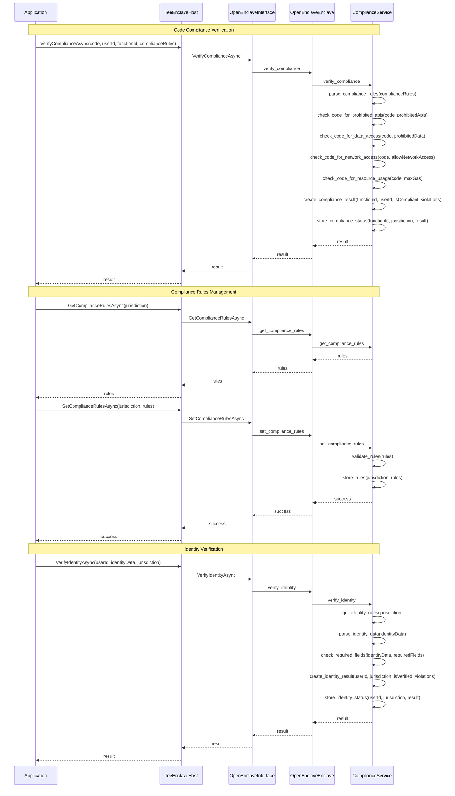

# Compliance Service Workflow

## Workflow Description

### Code Compliance Verification

1. The application calls VerifyComplianceAsync with the JavaScript code, user ID, function ID, and compliance rules.
2. The TeeEnclaveHost forwards the call to the OpenEnclaveInterface.
3. The OpenEnclaveInterface calls the verify_compliance method of the OpenEnclaveEnclave.
4. The OpenEnclaveEnclave calls the verify_compliance method of the ComplianceService.
5. The ComplianceService parses the compliance rules.
6. The ComplianceService performs various checks on the code:
   - Checks for prohibited APIs
   - Checks for prohibited data access
   - Checks for network access
   - Checks for resource usage
7. The ComplianceService creates a compliance result containing the function ID, user ID, compliance status, and any violations.
8. The ComplianceService stores the compliance status for the function.
9. The compliance result is returned to the application.

### Compliance Rules Management

1. **Getting Compliance Rules**:
   - The application calls GetComplianceRulesAsync with the jurisdiction.
   - The TeeEnclaveHost forwards the call to the OpenEnclaveInterface.
   - The OpenEnclaveInterface calls the get_compliance_rules method of the OpenEnclaveEnclave.
   - The OpenEnclaveEnclave calls the get_compliance_rules method of the ComplianceService.
   - The compliance rules for the jurisdiction are returned to the application.

2. **Setting Compliance Rules**:
   - The application calls SetComplianceRulesAsync with the jurisdiction and rules.
   - The TeeEnclaveHost forwards the call to the OpenEnclaveInterface.
   - The OpenEnclaveInterface calls the set_compliance_rules method of the OpenEnclaveEnclave.
   - The OpenEnclaveEnclave calls the set_compliance_rules method of the ComplianceService.
   - The ComplianceService validates the rules.
   - The ComplianceService stores the rules for the jurisdiction.
   - The success status is returned to the application.

### Identity Verification

1. The application calls VerifyIdentityAsync with the user ID, identity data, and jurisdiction.
2. The TeeEnclaveHost forwards the call to the OpenEnclaveInterface.
3. The OpenEnclaveInterface calls the verify_identity method of the OpenEnclaveEnclave.
4. The OpenEnclaveEnclave calls the verify_identity method of the ComplianceService.
5. The ComplianceService gets the identity rules for the jurisdiction.
6. The ComplianceService parses the identity data.
7. The ComplianceService checks if the identity data contains all required fields.
8. The ComplianceService creates an identity result containing the user ID, jurisdiction, verification status, and any violations.
9. The ComplianceService stores the identity status for the user.
10. The identity result is returned to the application.
