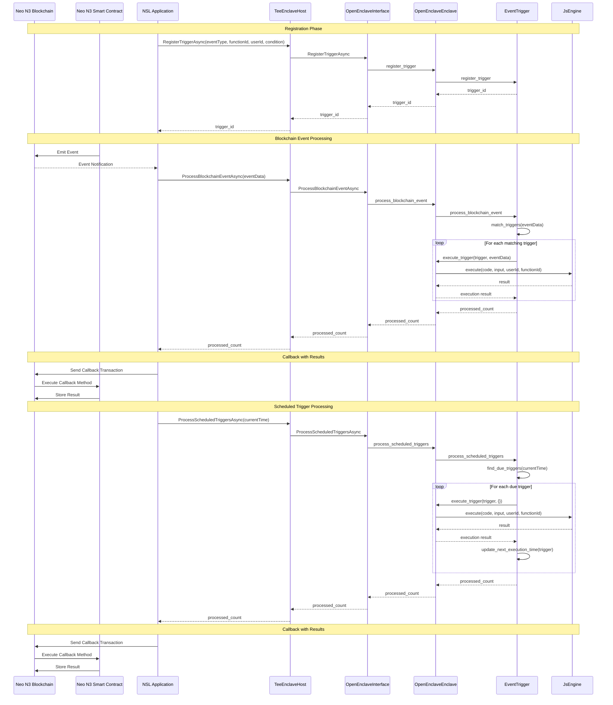

# Event Trigger Workflow

## Workflow Description

### Registration Phase

1. The NSL application calls RegisterTriggerAsync with the event type, function ID, user ID, and condition.
2. The TeeEnclaveHost forwards the call to the OpenEnclaveInterface.
3. The OpenEnclaveInterface calls the register_trigger method of the OpenEnclaveEnclave.
4. The OpenEnclaveEnclave calls the register_trigger method of the EventTrigger.
5. The EventTrigger creates a new trigger and returns the trigger ID.
6. The trigger ID is returned to the NSL application.

### Blockchain Event Processing

1. A Neo N3 smart contract emits an event on the blockchain.
2. The NSL application receives the event notification from the blockchain.
3. The NSL application calls ProcessBlockchainEventAsync with the event data.
4. The TeeEnclaveHost forwards the call to the OpenEnclaveInterface.
5. The OpenEnclaveInterface calls the process_blockchain_event method of the OpenEnclaveEnclave.
6. The OpenEnclaveEnclave calls the process_blockchain_event method of the EventTrigger.
7. The EventTrigger matches the event data against registered triggers.
8. For each matching trigger:
   - The EventTrigger calls the execute_trigger method of the OpenEnclaveEnclave.
   - The OpenEnclaveEnclave executes the JavaScript function associated with the trigger.
   - The result is returned to the EventTrigger.
9. The number of processed triggers is returned to the NSL application.

### Callback with Results

1. The NSL application sends a callback transaction to the blockchain with the execution results.
2. The blockchain executes the callback method on the smart contract.
3. The smart contract stores the results on the blockchain.

### Scheduled Trigger Processing

1. The NSL application calls ProcessScheduledTriggersAsync with the current time.
2. The TeeEnclaveHost forwards the call to the OpenEnclaveInterface.
3. The OpenEnclaveInterface calls the process_scheduled_triggers method of the OpenEnclaveEnclave.
4. The OpenEnclaveEnclave calls the process_scheduled_triggers method of the EventTrigger.
5. The EventTrigger finds triggers that are due for execution.
6. For each due trigger:
   - The EventTrigger calls the execute_trigger method of the OpenEnclaveEnclave.
   - The OpenEnclaveEnclave executes the JavaScript function associated with the trigger.
   - The result is returned to the EventTrigger.
   - The EventTrigger updates the next execution time of the trigger.
7. The number of processed triggers is returned to the NSL application.
8. The NSL application sends callback transactions to the blockchain with the execution results.
9. The blockchain executes the callback methods on the smart contracts.
10. The smart contracts store the results on the blockchain.
