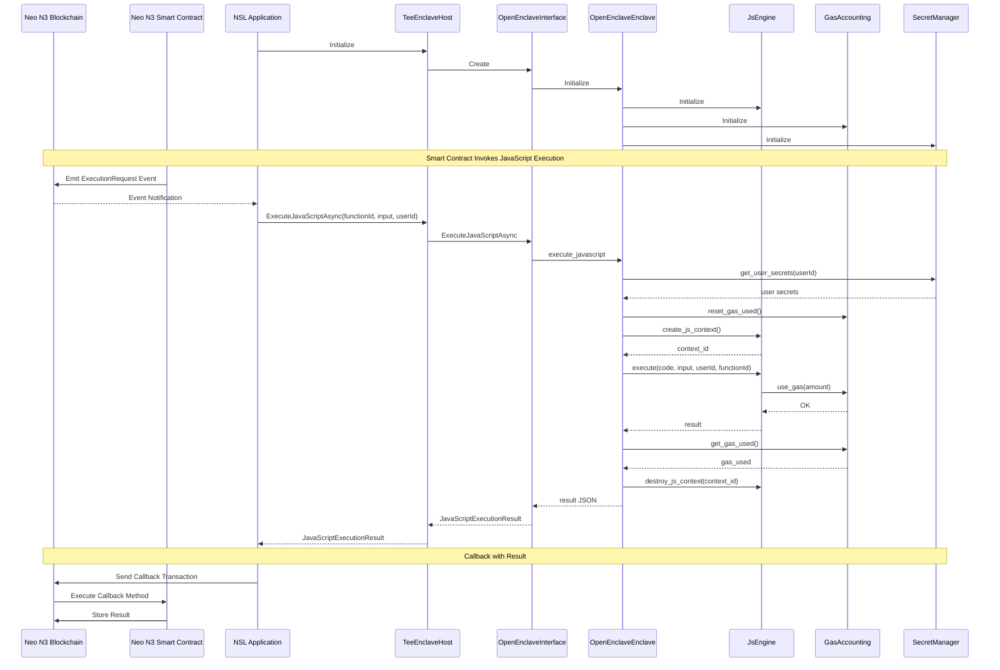

# JavaScript Execution Workflow

## Workflow Description

1. **Initialization**:
   - The NSL application initializes the TeeEnclaveHost.
   - The TeeEnclaveHost creates the OpenEnclaveInterface.
   - The OpenEnclaveInterface initializes the OpenEnclaveEnclave.
   - The OpenEnclaveEnclave initializes its components: JsEngine, GasAccounting, and SecretManager.

2. **Smart Contract Invokes JavaScript Execution**:
   - A Neo N3 smart contract emits an ExecutionRequest event on the blockchain.
   - The NSL application receives the event notification from the blockchain.
   - The NSL application calls ExecuteJavaScriptAsync with the function ID, input data, and user ID.
   - The TeeEnclaveHost forwards the call to the OpenEnclaveInterface.
   - The OpenEnclaveInterface calls the execute_javascript method of the OpenEnclaveEnclave.

3. **JavaScript Execution in Enclave**:
   - The OpenEnclaveEnclave retrieves the user's secrets from the SecretManager.
   - The OpenEnclaveEnclave resets the gas used counter.
   - The OpenEnclaveEnclave creates a JavaScript context.
   - The OpenEnclaveEnclave executes the JavaScript code using the JsEngine.
   - The JsEngine tracks gas usage during execution.
   - The JsEngine returns the result to the OpenEnclaveEnclave.
   - The OpenEnclaveEnclave gets the gas used from the GasAccounting.
   - The OpenEnclaveEnclave destroys the JavaScript context.
   - The OpenEnclaveEnclave returns the result as a JSON string to the OpenEnclaveInterface.
   - The OpenEnclaveInterface converts the JSON string to a JavaScriptExecutionResult object and returns it to the TeeEnclaveHost.
   - The TeeEnclaveHost returns the JavaScriptExecutionResult to the NSL application.

4. **Callback with Result**:
   - The NSL application sends a callback transaction to the blockchain with the execution result.
   - The blockchain executes the callback method on the smart contract.
   - The smart contract stores the result on the blockchain.
