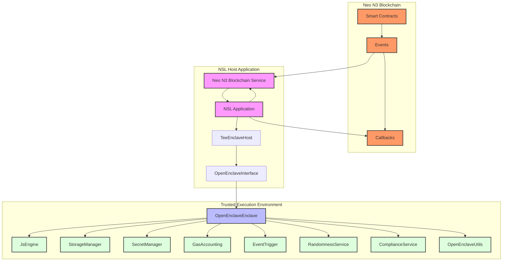

# Neo Service Layer Architecture

## Component Description

### Neo N3 Blockchain

- **Smart Contracts**: Neo N3 smart contracts that emit events to request JavaScript execution and receive results via callbacks.
- **Events**: Events emitted by smart contracts that the NSL listens for.
- **Callbacks**: Callback methods on smart contracts that the NSL calls to return results.

### NSL Host Application

- **NSL Application**: The application that uses the Neo Service Layer.
- **TeeEnclaveHost**: The host-side component that manages the enclave.
- **OpenEnclaveInterface**: The interface that provides methods for interacting with the enclave.
- **Neo N3 Blockchain Service**: The service that interacts with the Neo N3 blockchain, listening for events and sending transactions.

### Trusted Execution Environment

- **OpenEnclaveEnclave**: The main enclave class that provides the core functionality of the enclave.
- **JsEngine**: A JavaScript execution engine that runs JavaScript code securely within the enclave.
- **StorageManager**: A persistent storage manager that provides secure storage for enclave data.
- **SecretManager**: A secret manager that provides secure storage for user secrets.
- **GasAccounting**: A gas accounting system that tracks the computational resources used by JavaScript functions.
- **EventTrigger**: An event trigger system that allows JavaScript functions to be executed in response to specific events.
- **RandomnessService**: A provably fair randomness service that provides secure random number generation with verifiable proofs.
- **ComplianceService**: A compliance verification service that verifies JavaScript code for compliance with regulatory requirements.
- **OpenEnclaveUtils**: Utility functions for OpenEnclave operations.

### Workflow

1. Neo N3 smart contracts emit events on the blockchain.
2. The Neo N3 Blockchain Service in the NSL Application detects these events.
3. The NSL Application calls the TeeEnclaveHost to execute JavaScript functions in the enclave.
4. The JavaScript functions can access user secrets stored in the enclave.
5. The enclave executes the JavaScript functions securely.
6. The NSL Application receives the results and sends callback transactions to the blockchain.
7. The Neo N3 smart contracts receive the results via callback methods.
