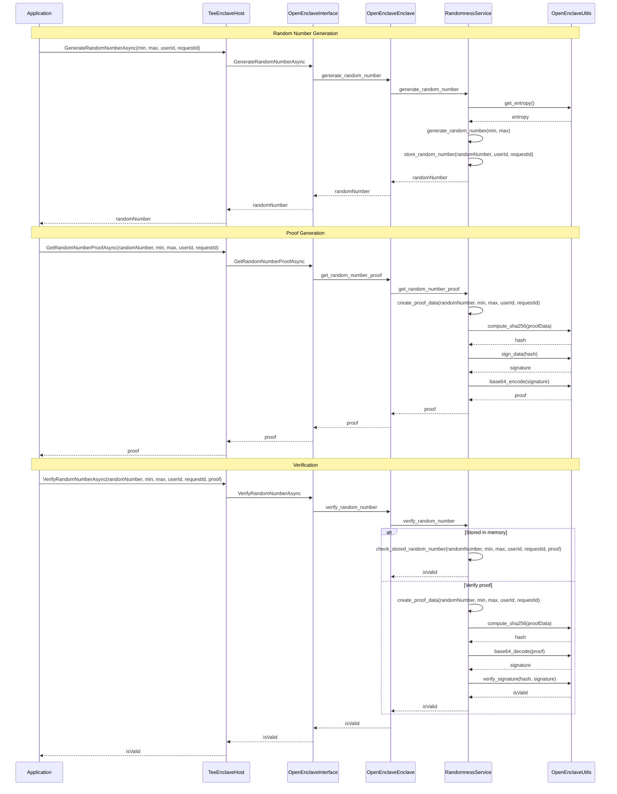

# Randomness Service Workflow

## Workflow Description

### Random Number Generation

1. The application calls GenerateRandomNumberAsync with the minimum and maximum values, user ID, and request ID.
2. The TeeEnclaveHost forwards the call to the OpenEnclaveInterface.
3. The OpenEnclaveInterface calls the generate_random_number method of the OpenEnclaveEnclave.
4. The OpenEnclaveEnclave calls the generate_random_number method of the RandomnessService.
5. The RandomnessService gets entropy from the OpenEnclaveUtils.
6. The RandomnessService generates a random number between the minimum and maximum values.
7. The RandomnessService stores the random number along with the user ID and request ID.
8. The random number is returned to the application.

### Proof Generation

1. The application calls GetRandomNumberProofAsync with the random number, minimum and maximum values, user ID, and request ID.
2. The TeeEnclaveHost forwards the call to the OpenEnclaveInterface.
3. The OpenEnclaveInterface calls the get_random_number_proof method of the OpenEnclaveEnclave.
4. The OpenEnclaveEnclave calls the get_random_number_proof method of the RandomnessService.
5. The RandomnessService creates proof data containing the random number, minimum and maximum values, user ID, request ID, and a timestamp.
6. The RandomnessService computes the SHA-256 hash of the proof data.
7. The RandomnessService signs the hash using the enclave's private key.
8. The RandomnessService base64-encodes the signature to create the proof.
9. The proof is returned to the application.

### Verification

1. The application calls VerifyRandomNumberAsync with the random number, minimum and maximum values, user ID, request ID, and proof.
2. The TeeEnclaveHost forwards the call to the OpenEnclaveInterface.
3. The OpenEnclaveInterface calls the verify_random_number method of the OpenEnclaveEnclave.
4. The OpenEnclaveEnclave calls the verify_random_number method of the RandomnessService.
5. The RandomnessService checks if the random number is stored in memory:
   - If it is, it compares the stored proof with the provided proof.
   - If it's not, it recreates the proof data, computes the hash, and verifies the signature.
6. The verification result is returned to the application.
